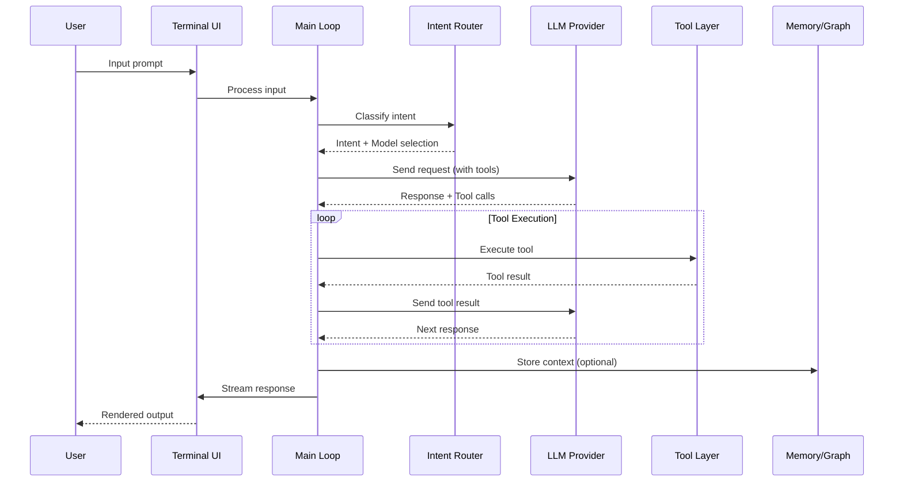
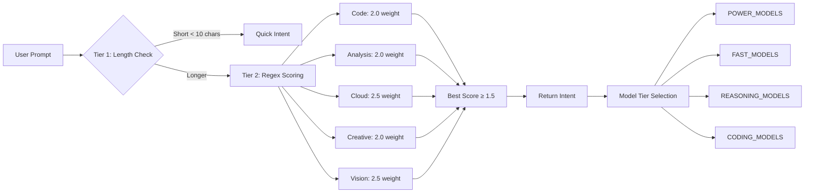
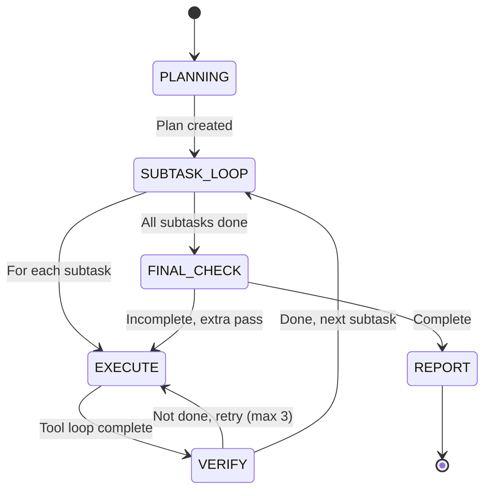
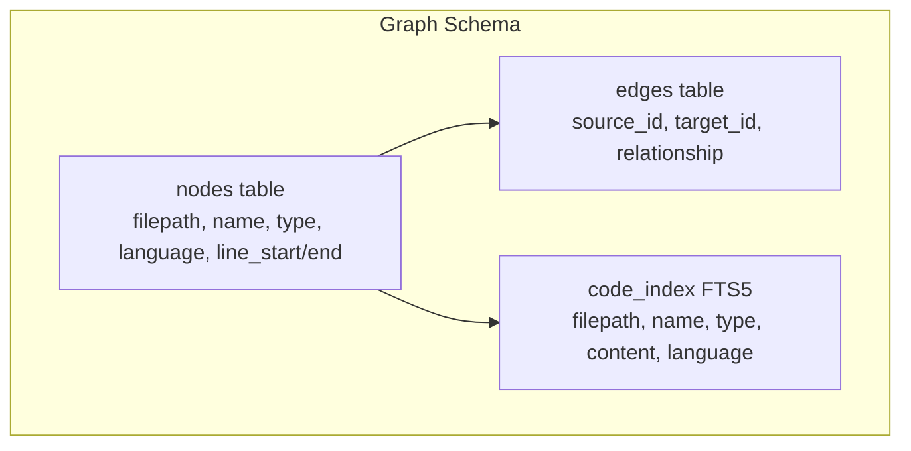
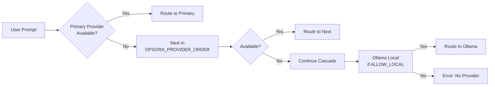
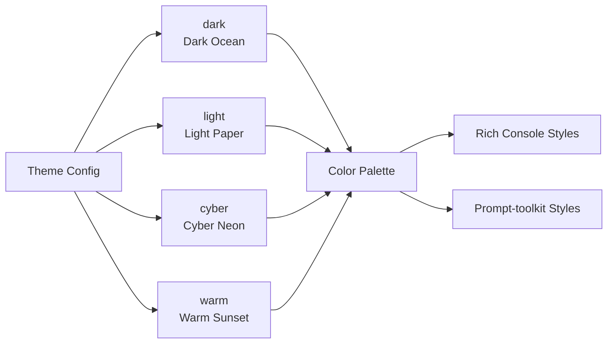
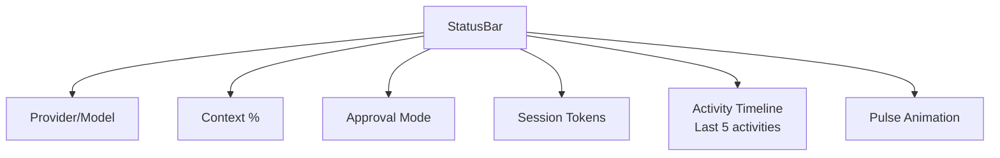
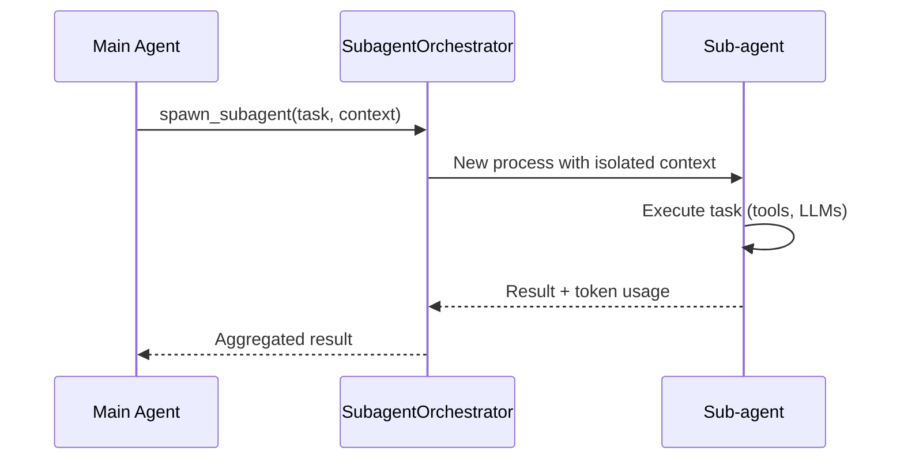

# Opsora CLI — System Architecture Documentation

> **Version:** 3.1  
> **Last Updated:** 2026-08-03  
> **Language:** Bilingual (Bahasa Indonesia + English)

---

## 📋 Overview | Ikhtisar

Opsora CLI is a **modular monolith** terminal AI assistant that connects to multiple LLM providers through a unified interface, featuring intelligent routing, persistent memory, knowledge graphs, and a rich terminal UI.

Opsora CLI adalah **modular monolith** terminal AI assistant yang terhubung ke multiple LLM providers melalui unified interface, dengan intelligent routing, persistent memory, knowledge graphs, dan rich terminal UI.

---

## 🏗️ High-Level Architecture | Arsitektur High-Level

```mermaid
graph TB
    subgraph "User Interface Layer"
        TUI[Rich TUI / REPL<br/>opsora_tui.py]
        SLASH[Slash Commands<br/>/help, /model, /status...]
        COMPLETER[Auto-complete<br/>prompt-toolkit]
    end

    subgraph "Core Engine"
        MAIN[Main Loop<br/>opsora_v2.py:main()]
        ROUTER[Intent Router<br/>opsora_routing.py]
        AGENT[Autonomous Agent<br/>opsora_agent.py]
        SESSION[Session Manager<br/>opsora_session.py]
    end

    subgraph "Provider Layer"
        NVIDIA[NVIDIA NIM<br/>Llama 3.1, Nemotron, Mistral]
        ALIBABA[Alibaba DashScope<br/>Qwen Plus/Max/Turbo]
        OPENAI[OpenAI<br/>GPT-4o, GPT-4o-mini]
        BEDROCK[AWS Bedrock<br/>Nova Pro/Lite]
        TOKENHUB[Tencent TokenHub<br/>Hunyuan, Kimi, DeepSeek]
        OLLAMA[Ollama Local<br/>Any local model]
        MODELSTUDIO[Model Studio<br/>Regional Qwen]
    end

    subgraph "Tool Layer"
        FILE[File I/O Tools<br/>read_file, write_file, edit_file]
        SHELL[Shell Execution<br/>run_command]
        MEMORY[Persistent Memory<br/>memory_add, memory_search]
        GRAPH[Knowledge Graph<br/>graphify_query]
        AWS[AWS CLI<br/>aws_command]
        WORKSPACE[Workspace Status<br/>workspace_status]
    end

    subgraph "Data Layer"
        SQLITE_SESSION[(SQLite: sessions.db)]
        SQLITE_MEMORY[(SQLite: memory.db)]
        SQLITE_GRAPH[(SQLite: graph.db + FTS5)]
    end

    subgraph "Extensions"
        MCP[MCP Client<br/>opsora_mcp.py]
        PLUGINS[Plugin System<br/>opsora_plugins.py]
        SUBAGENT[Sub-agent Orchestrator<br/>opsora_subagent.py]
    end

    TUI --> MAIN
    SLASH --> MAIN
    COMPLETER --> MAIN
    MAIN --> ROUTER
    MAIN --> AGENT
    MAIN --> SESSION
    ROUTER --> NVIDIA
    ROUTER --> ALIBABA
    ROUTER --> OPENAI
    ROUTER --> BEDROCK
    ROUTER --> TOKENHUB
    ROUTER --> OLLAMA
    ROUTER --> MODELSTUDIO
    MAIN --> FILE
    MAIN --> SHELL
    MAIN --> MEMORY
    MAIN --> GRAPH
    MAIN --> AWS
    MAIN --> WORKSPACE
    SESSION --> SQLITE_SESSION
    MEMORY --> SQLITE_MEMORY
    GRAPH --> SQLITE_GRAPH
    MAIN --> MCP
    MAIN --> PLUGINS
    AGENT --> SUBAGENT
```

---

## 🔄 Data Flow | Alur Data



---

## 🧠 Core Components | Komponen Inti

### 1. Main Application Loop (`opsora_v2.py`)

**Responsibilities:**
- Initialize all subsystems (TUI, providers, tools, memory, MCP, plugins)
- Manage conversation history and context
- Handle slash commands
- Coordinate agent loop and tool execution
- Manage approval modes (suggest, auto-edit, full-auto)
- Cost tracking integration

**Key Classes/Functions:**
```python
class Selection:          # Provider + model selection
def auto_select_model()   # Intent-based model routing
def execute_tool()        # Tool execution dispatcher
def main()                # Entry point
```

### 2. Intent Router (`opsora_routing.py`)

**Architecture:** Two-tier classification system



**Intent Categories:**
| Intent | Weight | Keywords | Model Tier |
|---|---|---|---|
| `code` | 2.0 | write, debug, fix, function, class, python, api, bug | CODING_MODELS |
| `quick` | 1.5 | yes/no, translate, what is, how to, convert, tldr | FAST_MODELS |
| `analysis` | 2.0 | analyze, compare, review, explain, research, architecture | REASONING_MODELS |
| `cloud` | 2.5 | aws, azure, gcp, deploy, kubernetes, terraform | POWER_MODELS |
| `creative` | 2.0 | write story, poem, marketing, brand | POWER_MODELS |
| `vision` | 2.5 | image, screenshot, diagram, ocr, visual | VISION_MODELS |
| `general` | - | fallback | POWER_MODELS |

### 3. Autonomous Agent (`opsora_agent.py`)

**Architecture:** ReAct loop with planning, execution, verification



**Key Features:**
- **Planning:** Decomposes request into 2-8 subtasks via LLM
- **Execution:** ReAct tool-calling loop (max 8 rounds/subtask)
- **Verification:** LLM checks if subtask actually complete
- **Retry Logic:** Up to 3 attempts with failure analysis
- **Context Compression:** Keeps last 10 messages per subtask
- **Kill Switch:** `/abort` sets global flag

### 4. Session Manager (`opsora_session.py`)

**Storage:** SQLite (`/root/.opsora/sessions.db`)

```sql
CREATE TABLE sessions (
    id TEXT PRIMARY KEY,
    title TEXT,
    provider TEXT,
    model TEXT,
    created_at REAL,
    updated_at REAL,
    token_count INTEGER,
    approval_mode TEXT
);

CREATE TABLE messages (
    id INTEGER PRIMARY KEY AUTOINCREMENT,
    session_id TEXT,
    role TEXT,
    content TEXT,
    tool_calls TEXT,
    tool_call_id TEXT,
    name TEXT,
    created_at REAL,
    FOREIGN KEY (session_id) REFERENCES sessions(id)
);
```

**Operations:**
- `save_session()` — Persist conversation with token estimation
- `load_session()` — Resume with full history
- `list_sessions()` — Recent 20 sessions
- `search_sessions()` — Full-text search in messages
- `delete_session()` — Cascade delete

### 5. Persistent Memory (`opsora_memory.py`)

**Storage:** SQLite (`/root/.opsora/memory.db`)

```sql
CREATE TABLE memories (
    id INTEGER PRIMARY KEY,
    text TEXT NOT NULL,
    source TEXT DEFAULT 'cli',
    created_at REAL
);
```

**Features:**
- Survives across CLI sessions
- Keyword-based search (not vector — lightweight)
- 4096 char limit per memory
- Source tracking (cli, agent, user, etc.)

### 6. Knowledge Graph v2 (`opsora_graph_v2.py`)

**Storage:** SQLite + FTS5 (`/root/.opsora/graph.db`)



**Entity Extraction:**
- **Python:** Functions (`def`), Classes (`class`)
- **JS/TS:** Imports (`import from`, `require()`)
- **Relationships:** `contains` (file→entity), `imports` (file→module), `calls` (function→function)

**Query Flow:**
```
graph_query("auth middleware")
    │
    ├─► FTS5 Search (MATCH query)
    │
    ├─► Find node IDs
    │
    ├─► Edge traversal (depth 2)
    │
    └─► Return: node + snippet + related entities
```

### 7. Cost Tracker (`opsora_cost.py`)

**Pricing Model (per 1M tokens):**
| Model | Input | Output |
|---|---|---|
| qwen-plus | $0.40 | $1.20 |
| qwen-turbo | $0.05 | $0.20 |
| qwen-max | $2.00 | $6.00 |
| llama-3.1-70b | $0.35 | $0.70 |
| llama-3.1-8b | $0.05 | $0.10 |
| deepseek-v4-flash | $0.02 | $0.02 |

**Features:**
- In-memory session tracking
- Per-model breakdown
- Real-time extraction from API responses
- `render_summary()` for Rich display

---

## 🔌 Provider Layer | Layer Provider

### Provider Abstraction

All providers implement **OpenAI-compatible** interface via `OpenAI` client:

```python
def get_nvidia_client() -> Optional[OpenAI]:
    key = os.environ.get("NVIDIA_API_KEY")
    if key:
        return OpenAI(
            api_key=key,
            base_url="https://integrate.api.nvidia.com/v1",
            timeout=40
        )
```

### Provider Configuration Matrix

| Provider | Env Var | Base URL | Models | Auth |
|---|---|---|---|---|
| NVIDIA | `NVIDIA_API_KEY` | `integrate.api.nvidia.com/v1` | 11 models | API Key |
| Alibaba | `DASHSCOPE_API_KEY` | `dashscope-intl.aliyuncs.com/compatible-mode/v1` | 6 models | API Key |
| Model Studio | `DASHSCOPE_API_KEY` | `ws-u05t2ivr...maas.aliyuncs.com` | 2 models | API Key |
| OpenAI | `OPENAI_API_KEY` | `api.openai.com/v1` | 2 models | API Key |
| Bedrock | `AWS_PROFILE` | AWS Converse API | 2 models | AWS Creds |
| TokenHub | `TOKENHUB_API_KEY` | `tokenhub.tencentmaas.com/v1` | 4 models | API Key |
| Opsora API | `OPSORA_API_TOKEN` | `${OPSORA_API_URL}/v1` | 3 models | Bearer Token |
| Ollama | `OPSORA_OLLAMA_URL` | `127.0.0.1:11434/v1` | Any | None |

### Fallback Cascade



---

## 🛠️ Tool Layer | Layer Tools

### Tool Schema (OpenAI Function Calling Format)

```python
SAFE_TOOLS = [
    # EXPLORE - Use FIRST
    {"type": "function", "function": {
        "name": "glob_search",
        "description": "Find files by pattern. USE FIRST...",
        "parameters": {"type": "object", "properties": {
            "pattern": {"type": "string"},
            "base": {"type": "string"}
        }, "required": ["pattern"]}
    }},
    # ... more tools
]
```

### Tool Categories

| Category | Tools | Purpose |
|---|---|---|
| **Explore** | glob_search, read_file, grep_search, list_directory | Understand codebase FIRST |
| **Code Changes** | write_file, edit_file, run_command | Modify code AFTER understanding |
| **Verify** | run_tests, lint_check | Validate changes |
| **Git** | git_status, git_diff, git_log, git_commit | Version control |
| **Task Tracking** | todo_write | Plan complex tasks |
| **Research** | web_search, web_fetch, http_request | External info |
| **Database** | db_query | SQLite inspection |
| **Memory/Context** | memory_add, memory_search, graphify_query, workspace_status | Persistent context |
| **Utility** | image_read, pip_info | Misc |

### Security Model

```python
SENSITIVE_PATHS = {".aws", ".ssh", ".gnupg", ".tccli"}
SENSITIVE_FILES = {"render.env", "secrets.env", ".opsora_env", "credentials", ".env"}
CREDENTIAL_KEYWORDS = ["api_key", "secret_key", "password", "token", "access_key"]

def execute_tool(name, args):
    # Path resolution
    fp = Path(args["filepath"])
    if not fp.is_absolute():
        fp = WORKSPACE_ROOT / fp
    resolved = fp.resolve()
    
    # Block sensitive paths
    if SENSITIVE_PATHS & set(resolved.parts):
        return "BLOCKED: folder credential (.aws/.ssh/.gnupg) gak bisa dibaca."
    if resolved.name in SENSITIVE_FILES:
        return f"BLOCKED: {resolved.name} berisi credentials."
```

---

## 🎨 Terminal UI System (`opsora_tui.py`)

### Theme System



**Color Palette per Theme:**
```python
THEMES = {
    "dark": {
        "accent": "#5fb8c0",
        "success": "#6abf69",
        "warning": "#d4a843",
        "error": "#d45555",
        "bg": "#0d1117",
        "text": "#e6edf3",
    },
    "cyber": {
        "accent": "#00ffff",
        "success": "#00ff88",
        "error": "#ff4444",
        "bg": "#0a0a0a",
        "text": "#ffffff",
    }
}
```

### Status Bar Components



### Streaming Markdown

```python
def stream_markdown(text: str, speed: float = 0.005):
    cursor_chars = ["▌", "▐", "▄", "▀"]
    with Live(refresh_per_second=30) as live:
        for i, char in enumerate(text):
            out += char
            cursor = cursor_chars[(i//2) % 4] if i % 2 == 0 else ""
            live.update(Markdown(out + cursor))
            time.sleep(speed)
```

---

## 🔌 MCP Integration (`opsora_mcp.py`)

### Architecture

```mermaid
graph TB
    subgraph "MCP Client"
        CONFIG[Load Config<br/>~/.opsora/mcp.json]
        MANAGER[MCPClient]
    end

    subgraph "Transport: stdio"
        PROCESS[Subprocess Popen]
        STDIN[stdin: JSON-RPC]
        STDOUT[stdout: JSON-RPC]
    end

    subgraph "Transport: HTTP"
        HTTP[urllib.request]
        ENDPOINT[/mcp/tools, /mcp/tools/call]
    end

    CONFIG --> MANAGER
    MANAGER --> PROCESS
    MANAGER --> HTTP
    PROCESS --> STDIN
    PROCESS --> STDOUT
    HTTP --> ENDPOINT
```

### Tool Naming Convention

```
mcp__{server_name}__{tool_name}
```

Example: `mcp__github__create_issue`

### Server Configuration

```json
{
  "mcpServers": {
    "github": {
      "command": "npx",
      "args": ["-y", "@modelcontextprotocol/server-github"],
      "env": {"GITHUB_PERSONAL_ACCESS_TOKEN": "..."}
    },
    "filesystem": {
      "command": "npx",
      "args": ["-y", "@modelcontextprotocol/server-filesystem", "/root"]
    }
  }
}
```

---

## 📦 Plugin System (`opsora_plugins.py`)

### Plugin Structure

```python
class OpsoraPlugin(ABC):
    name: str = ""
    description: str = ""
    version: str = "0.1.0"

    @abstractmethod
    def schema(self) -> dict:      # OpenAI function schema
    @abstractmethod
    def execute(self, args: dict) -> str:  # Implementation
```

### Discovery & Loading

```
~/.opsora/plugins/
├── my_tool.py          # Loaded as plugin
├── _private.py         # Ignored (underscore prefix)
└── another_tool.py     # Loaded as plugin
```

```python
def discover() -> list[str]:
    for fpath in PLUGINS_DIR.glob("*.py"):
        if fpath.name.startswith("_"): continue
        # Import module
        # Find OpsoraPlugin subclass
        # Instantiate and register
```

---

## 🤖 Sub-agent Orchestration (`opsora_subagent.py`)

### Use Cases

| Scenario | Description |
|---|---|
| Parallel file analysis | Analyze multiple files simultaneously |
| Research delegation | Delegate web search to sub-agent |
| Code generation | Generate boilerplate in background |
| Test generation | Create tests for multiple modules |

### Communication



---

## 🔄 Context Compression (`opsora_compression.py`)

### Strategies

| Strategy | Trigger | Action |
|---|---|---|
| **Summarize** | Context > 80% window | LLM summarizes old messages |
| **Drop Oldest** | Context > 95% window | Remove oldest non-system messages |
| **Token Budget** | Per-model limits | Enforce MAX_CONTEXT_TOKENS (131k) |

---

## 🗂️ File Structure Map

```
opsora-cli/
├── opsora_cmd/
│   ├── __init__.py
│   ├── opsora_v2.py           # ★ Main entry point (2371 lines)
│   ├── opsora_routing.py      # Intent router & model selection
│   ├── opsora_mcp.py          # MCP client (stdio + HTTP)
│   ├── opsora_agent.py        # Autonomous agent (planning + ReAct)
│   ├── opsora_session.py      # Session persistence (SQLite)
│   ├── opsora_memory.py       # Persistent memory (SQLite)
│   ├── opsora_tools.py        # Workspace tools & graphify
│   ├── opsora_tui.py          # Terminal UI (themes, streaming)
│   ├── opsora_plugins.py      # Plugin system
│   ├── opsora_graph_v2.py     # Knowledge graph (FTS5 + edges)
│   ├── opsora_cost.py         # Cost tracking
│   ├── opsora_themes.py       # Theme definitions
│   ├── opsora_compression.py  # Context compression
│   ├── opsora_new_tools.py    # Extended toolset
│   ├── opsora_reflect_v2.py   # Self-reflection
│   ├── opsora_subagent.py     # Sub-agent orchestration
│   ├── opsora_streaming.py    # Streaming responses
│   ├── openai_lite.py         # Lightweight OpenAI client
│   ├── problem_solver.py      # 5-step problem solving
│   ├── discord_rest_mcp.py    # Discord REST MCP
│   ├── nvidia_ngc_mcp.py      # NVIDIA NGC MCP
│   ├── opsora_google_mcp.py   # Google services MCP
│   ├── opsora_google.py       # Google OAuth integration
│   ├── outlook_mcp.py         # Outlook MCP
│   ├── opsora_gmail.js        # Gmail MCP (Node.js)
│   ├── telegram_mcp_server.py # Telegram MCP
│   ├── telegram_auth.py       # Telegram auth
│   ├── opsora_autonomous.py   # Autonomous mode
│   └── problem_solver.py      # Problem solving framework
├── marketing_hub/
│   ├── hub.py                 # Main hub
│   ├── content_engine.py      # Content generation
│   ├── discord_poster.py      # Discord posting
│   ├── telegram_poster.py     # Telegram posting
│   └── config.py              # Marketing config
├── scripts/
│   └── test-tencent-services.sh
├── tests/
│   ├── conftest.py
│   ├── test_compression.py
│   ├── test_memory.py
│   ├── test_routing.py
│   ├── test_session.py
│   ├── test_tokenhub.py
│   └── test_tools.py
├── .github/ISSUE_TEMPLATE/
│   ├── bug_report.md
│   └── feature_request.md
├── claude-code-termux/        # Termux/Claude Code integration
├── install.sh
├── pyproject.toml
├── LICENSE
├── README.md
├── ARCHITECTURE.md
├── CONTRIBUTING.md
├── DEPLOYMENT.md
├── PROVIDERS.md
├── MCP_SERVERS.md
├── EXTENSIONS.md
└── TROUBLESHOOTING.md
```

---

## 🔒 Security Architecture

### Credential Handling

```mermaid
graph TB
    ENV[.opsora_env<br/>~/.opsora/qwen-code/secrets.env]
    LOAD[load_env_file()]
    OS[os.environ.setdefault()]
    CLIENT[Provider Clients<br/>Lazy initialization]
    
    ENV --> LOAD
    LOAD --> OS
    OS --> CLIENT
```

**Rules:**
- Never log API keys (redacted in `redact_display()`)
- `.opsora_env` gitignored
- Read-only AWS operations by default
- Path traversal protection in file tools
- Sensitive path/file blocking

### Approval Modes

| Mode | File Read | File Write | Shell Command | AWS Read |
|---|---|---|---|---|
| `suggest` | ❌ Ask | ❌ Ask | ❌ Ask | ❌ Ask |
| `auto-edit` | ✅ Auto | ✅ Auto | ❌ Ask | ✅ Auto |
| `full-auto` (default) | ✅ Auto | ✅ Auto | ✅ Auto | ✅ Auto |

---

## 📈 Performance Characteristics

| Metric | Value | Notes |
|---|---|---|
| Startup Time | ~1.5s | Lazy provider initialization |
| First Token Latency | ~0.8-3s | Depends on model/provider |
| Tool Execution | ~50-500ms | Local tools faster |
| Memory Search | ~10-50ms | SQLite FTS5 |
| Graph Query | ~20-100ms | FTS5 + edge traversal |
| Context Window | 131k tokens | Per-model limits enforced |

---

## 🧪 Testing Architecture

```
tests/
├── conftest.py              # Pytest fixtures
├── test_compression.py      # Context compression
├── test_memory.py           # Memory persistence
├── test_routing.py          # Intent classification
├── test_session.py          # Session save/load
├── test_tokenhub.py         # TokenHub provider
└── test_tools.py            # Tool execution
```

**Run:** `pytest tests/ -v`

---

## 🔮 Future Architecture Considerations

### Planned Improvements

1. **Plugin API v2** — WASM-based plugins for language agnostic extensions
2. **Distributed Memory** — Redis-backed memory for team sharing
3. **GraphQL Gateway** — Unified API for dashboard integration
4. **Streaming First** — Full streaming support for all providers
5. **Multi-session TUI** — Tabbed interface for concurrent conversations
6. **Vector Memory** — Embeddings-based semantic search
7. **Agent Marketplace** — Discoverable, installable agent templates

---

## 📚 Related Documentation

| Document | Description |
|---|---|
| [README.md](README.md) | Quick start & overview |
| [PROVIDERS.md](PROVIDERS.md) | Provider configs & models |
| [MCP_SERVERS.md](MCP_SERVERS.md) | MCP server setup |
| [EXTENSIONS.md](EXTENSIONS.md) | Extensions & agents |
| [DEPLOYMENT.md](DEPLOYMENT.md) | Deployment guides |
| [TROUBLESHOOTING.md](TROUBLESHOOTING.md) | Common issues |

---

*Generated for Opsora CLI v3.1 — Architecture docs should be updated with each major release.*