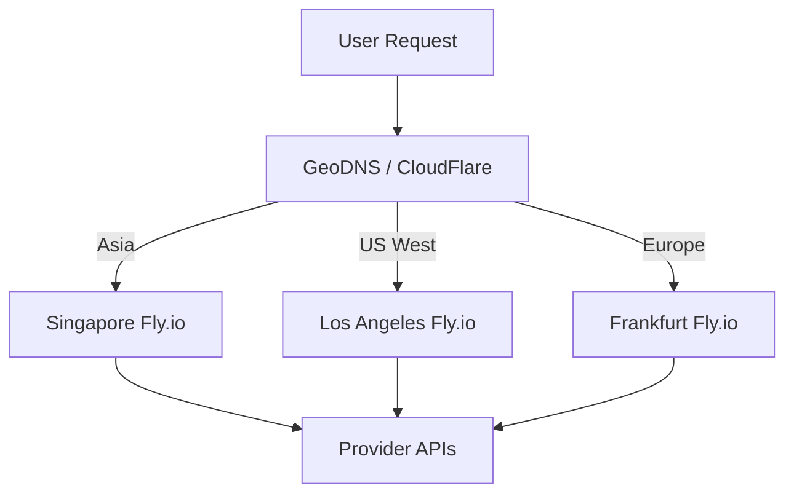

# Opsora CLI — Deployment Guide

> **Bahasa Indonesia + English**  
> Panduan deployment Opsora CLI ke berbagai platform: Fly.io, Render, Vercel, Docker, Kubernetes, VPS.

---

## 📦 Overview | Ikhtisar

Opsora CLI dapat di-deploy sebagai:
- **CLI Tool** — Local development (primary use case)
- **Containerized Service** — Docker untuk CI/CD, headless execution
- **API Gateway** — Backend service via `opsora-api` (separate project)
- **Web Dashboard** — Next.js dashboard (separate project: `opsora-dashboard`)

---

## 🐳 Docker Deployment

### Build Image

```dockerfile
# Dockerfile
FROM python:3.12-slim

WORKDIR /app

# Install system dependencies
RUN apt-get update && apt-get install -y \
    git \
    curl \
    && rm -rf /var/lib/apt/lists/*

# Copy and install Python dependencies
COPY pyproject.toml README.md ./
COPY opsora_cmd/ ./opsora_cmd/
RUN pip install --no-cache-dir -e .

# Create non-root user
RUN useradd -m -u 1000 opsora
USER opsora

# Entry point
ENTRYPOINT ["opsora"]
```

### Build & Run

```bash
# Build
docker build -t opsora-cli:latest .

# Run interactive
docker run -it --rm \
  -v ~/.opsora_env:/home/opsora/.opsora_env:ro \
  -v $(pwd):/workspace \
  -w /workspace \
  opsora-cli:latest

# Run headless (for CI/CD)
docker run --rm \
  -v ~/.opsora_env:/home/opsora/.opsora_env:ro \
  -v $(pwd):/workspace \
  -w /workspace \
  opsora-cli:latest \
  /model alibaba qwen-plus /run "pytest tests/"
```

### Docker Compose (Development)

```yaml
# docker-compose.yml
version: '3.8'

services:
  opsora:
    build: .
    volumes:
      - ~/.opsora_env:/home/opsora/.opsora_env:ro
      - ./:/workspace
    working_dir: /workspace
    stdin_open: true
    tty: true
    environment:
      - OPSORA_PROVIDER_ORDER=alibaba,nvidia,local
      - OPSORA_ALLOW_LOCAL_FALLBACK=true
    profiles: ["dev"]

  opsora-ci:
    build: .
    volumes:
      - ~/.opsora_env:/home/opsora/.opsora_env:ro
      - ./:/workspace
    working_dir: /workspace
    command: ["/model", "alibaba", "qwen-plus", "/run", "pytest tests/"]
    profiles: ["ci"]
```

```bash
# Development
docker compose --profile dev up

# CI
docker compose --profile ci up --abort-on-container-exit
```

---

## ☁️ Fly.io Deployment

### Prerequisites

- Fly.io account: https://fly.io
- `flyctl` installed: `curl -L https://fly.io/install.sh | sh`

### Configuration

```toml
# fly.toml
app = "opsora-cli"
primary_region = "sin"  # Singapore for Asia-Pacific

[build]
  dockerfile = "Dockerfile"

[env]
  OPSORA_PROVIDER_ORDER = "alibaba,nvidia,local"
  OPSORA_ALLOW_LOCAL_FALLBACK = "true"
  # Secrets set via fly secrets set

[processes]
  app = "opsora"

[http_service]
  internal_port = 8080
  force_https = true
  auto_stop_machines = true
  auto_start_machines = true
  min_machines_running = 0

[[vm]]
  memory = "512mb"
  cpu_kind = "shared"
  cpus = 1
```

### Deploy

```bash
# Login
fly auth login

# Create app (first time)
fly apps create opsora-cli --org personal

# Set secrets
fly secrets set NVIDIA_API_KEY=your-key
fly secrets set DASHSCOPE_API_KEY=your-key
fly secrets set OPENAI_API_KEY=your-key

# Deploy
fly deploy

# Check status
fly status

# View logs
fly logs

# SSH into running instance
fly ssh console
```

### Scaling

```bash
# Scale to 2 instances
fly scale count 2

# Scale memory
fly scale memory 1024

# Autoscale config
fly autoscale set min=0 max=5
```

---

## 🎨 Render Deployment

### Prerequisites

- Render account: https://render.com
- GitHub repo connected

### render.yaml (Blueprint)

```yaml
# render.yaml
services:
  - type: worker
    name: opsora-cli
    runtime: docker
    dockerfilePath: ./Dockerfile
    envVars:
      - key: OPSORA_PROVIDER_ORDER
        value: alibaba,nvidia,local
      - key: OPSORA_ALLOW_LOCAL_FALLBACK
        value: "true"
      - key: NVIDIA_API_KEY
        sync: false
      - key: DASHSCOPE_API_KEY
        sync: false
      - key: OPENAI_API_KEY
        sync: false
    resources:
      cpu: 0.5
      memory: 512M
    autoDeploy: true
```

### Manual Setup (Web Service)

1. **New Web Service** → Connect GitHub repo
2. **Environment:** Docker
3. **Build Command:** (empty - uses Dockerfile)
4. **Start Command:** `opsora` (or custom)
5. **Environment Variables:**
   ```
   OPSORA_PROVIDER_ORDER=alibaba,nvidia,local
   OPSORA_ALLOW_LOCAL_FALLBACK=true
   NVIDIA_API_KEY=***
   DASHSCOPE_API_KEY=***
   OPENAI_API_KEY=***
   ```
6. **Instance Type:** Starter (512MB RAM, 0.5 CPU)

### Cron Job (Scheduled Tasks)

```yaml
# render.yaml - add cron job
cronJobs:
  - name: opsora-nightly-tests
    schedule: "0 2 * * *"  # 2 AM daily
    runtime: docker
    dockerfilePath: ./Dockerfile
    envVars:
      - key: OPSORA_PROVIDER_ORDER
        value: alibaba,nvidia,local
    command: ["/model", "alibaba", "qwen-plus", "/run", "pytest tests/ -v"]
    resources:
      cpu: 1
      memory: 1G
```

---

## △ Vercel Deployment (Edge Functions)

> **Note:** Opsora CLI is primarily a terminal tool. Vercel deployment is for the **Opsora API Gateway** or **Dashboard** projects.

### opsora-api (API Gateway)

```json
// vercel.json
{
  "buildCommand": "pip install -r requirements.txt",
  "outputDirectory": ".",
  "devCommand": "python -m uvicorn main:app --reload",
  "installCommand": "pip install -r requirements.txt",
  "framework": "none",
  "functions": {
    "api/**/*.py": {
      "maxDuration": 30
    }
  },
  "env": {
    "OPSORA_PROVIDER_ORDER": "alibaba,nvidia,local",
    "OPSORA_ALLOW_LOCAL_FALLBACK": "true"
  }
}
```

```python
# api/chat.py
from fastapi import FastAPI, HTTPException
from pydantic import BaseModel
import opsora_v2

app = FastAPI()

class ChatRequest(BaseModel):
    prompt: str
    provider: str = None
    model: str = None

@app.post("/chat")
async def chat(request: ChatRequest):
    # Initialize Opsora engine
    # Route request
    # Return response
    pass
```

### Deploy to Vercel

```bash
# Install Vercel CLI
npm i -g vercel

# Login
vercel login

# Deploy
vercel --prod

# Set environment variables
vercel env add NVIDIA_API_KEY
vercel env add DASHSCOPE_API_KEY
vercel env add OPENAI_API_KEY
```

---

## 🖥️ VPS / Bare Metal Deployment

### System Requirements

| Component | Minimum | Recommended |
|---|---|---|
| CPU | 1 vCPU | 2+ vCPU |
| RAM | 1 GB | 4 GB |
| Disk | 5 GB | 20 GB |
| OS | Ubuntu 22.04+ / Debian 12+ | Ubuntu 24.04 LTS |

### Setup Script

```bash
#!/bin/bash
# setup-opsora-vps.sh

set -e

echo "🔧 Setting up Opsora CLI on VPS..."

# Update system
apt-get update && apt-get upgrade -y

# Install Python 3.12
apt-get install -y software-properties-common
add-apt-repository -y ppa:deadsnakes/ppa
apt-get update
apt-get install -y python3.12 python3.12-venv python3.12-dev

# Install dependencies
apt-get install -y git curl build-essential libssl-dev libffi-dev

# Create opsora user
useradd -m -s /bin/bash opsora
usermod -aG sudo opsora

# Switch to opsora user
sudo -u opsora bash << 'EOF'
cd ~

# Clone repo
git clone https://github.com/opsora/opsora-cli.git
cd opsora-cli

# Create virtual environment
python3.12 -m venv venv
source venv/bin/activate

# Install
pip install --upgrade pip
pip install -e .

# Create config directory
mkdir -p ~/.opsora

# Create environment file template
cat > ~/.opsora_env << 'ENVEOF'
# Provider API Keys
NVIDIA_API_KEY=
DASHSCOPE_API_KEY=
OPENAI_API_KEY=
TOKENHUB_API_KEY=

# Provider priority order
OPSORA_PROVIDER_ORDER=alibaba,nvidia,local
OPSORA_ALLOW_LOCAL_FALLBACK=true

# AWS Bedrock
AWS_PROFILE=default
AWS_DEFAULT_REGION=us-east-1

# Ollama (optional)
OPSORA_OLLAMA_URL=http://127.0.0.1:11434/v1
ENVEOF

echo "✅ Setup complete!"
echo "Edit ~/.opsora_env with your API keys"
echo "Run: source ~/opsora-cli/venv/bin/activate && opsora"
EOF
```

### Systemd Service (Background Daemon)

```ini
# /etc/systemd/system/opsora.service
[Unit]
Description=Opsora CLI Daemon
After=network.target

[Service]
Type=simple
User=opsora
WorkingDirectory=/home/opsora/opsora-cli
Environment=PATH=/home/opsora/opsora-cli/venv/bin:/usr/local/bin:/usr/bin:/bin
EnvironmentFile=/home/opsora/.opsora_env
ExecStart=/home/opsora/opsora-cli/venv/bin/opsora --daemon
Restart=on-failure
RestartSec=10
StandardOutput=journal
StandardError=journal

[Install]
WantedBy=multi-user.target
```

```bash
# Enable and start
sudo systemctl daemon-reload
sudo systemctl enable opsora
sudo systemctl start opsora
sudo systemctl status opsora

# View logs
sudo journalctl -u opsora -f
```

### Nginx Reverse Proxy (for API Gateway)

```nginx
# /etc/nginx/sites-available/opsora-api
server {
    listen 80;
    server_name api.opsora.yourdomain.com;

    location / {
        proxy_pass http://127.0.0.1:8080;
        proxy_http_version 1.1;
        proxy_set_header Upgrade $http_upgrade;
        proxy_set_header Connection 'upgrade';
        proxy_set_header Host $host;
        proxy_cache_bypass $http_upgrade;
        proxy_set_header X-Real-IP $remote_addr;
        proxy_set_header X-Forwarded-For $proxy_add_x_forwarded_for;
        proxy_set_header X-Forwarded-Proto $scheme;
        
        # Timeouts
        proxy_connect_timeout 60s;
        proxy_send_timeout 60s;
        proxy_read_timeout 120s;
    }

    # WebSocket support
    location /ws {
        proxy_pass http://127.0.0.1:8080;
        proxy_http_version 1.1;
        proxy_set_header Upgrade $http_upgrade;
        proxy_set_header Connection "upgrade";
    }
}
```

```bash
# Enable site
sudo ln -s /etc/nginx/sites-available/opsora-api /etc/nginx/sites-enabled/
sudo nginx -t
sudo systemctl reload nginx
```

---

## ☸️ Kubernetes Deployment

### Namespace & ConfigMap

```yaml
# k8s/namespace.yaml
apiVersion: v1
kind: Namespace
metadata:
  name: opsora
```

```yaml
# k8s/configmap.yaml
apiVersion: v1
kind: ConfigMap
metadata:
  name: opsora-config
  namespace: opsora
data:
  OPSORA_PROVIDER_ORDER: "alibaba,nvidia,local"
  OPSORA_ALLOW_LOCAL_FALLBACK: "true"
  AWS_DEFAULT_REGION: "us-east-1"
```

### Secrets

```yaml
# k8s/secrets.yaml (apply with kubectl apply -f -)
apiVersion: v1
kind: Secret
metadata:
  name: opsora-secrets
  namespace: opsora
type: Opaque
stringData:
  NVIDIA_API_KEY: "your-nvidia-key"
  DASHSCOPE_API_KEY: "your-dashscope-key"
  OPENAI_API_KEY: "your-openai-key"
  TOKENHUB_API_KEY: "your-tokenhub-key"
  AWS_ACCESS_KEY_ID: "your-aws-key"
  AWS_SECRET_ACCESS_KEY: "your-aws-secret"
```

### Deployment

```yaml
# k8s/deployment.yaml
apiVersion: apps/v1
kind: Deployment
metadata:
  name: opsora-cli
  namespace: opsora
  labels:
    app: opsora-cli
spec:
  replicas: 2
  selector:
    matchLabels:
      app: opsora-cli
  template:
    metadata:
      labels:
        app: opsora-cli
    spec:
      containers:
        - name: opsora
          image: ghcr.io/opsora/opsora-cli:latest
          imagePullPolicy: Always
          envFrom:
            - configMapRef:
                name: opsora-config
            - secretRef:
                name: opsora-secrets
          resources:
            requests:
              memory: "512Mi"
              cpu: "250m"
            limits:
              memory: "1Gi"
              cpu: "1000m"
          livenessProbe:
            exec:
              command: ["opsora", "/status"]
            initialDelaySeconds: 30
            periodSeconds: 30
          readinessProbe:
            exec:
              command: ["opsora", "/status"]
            initialDelaySeconds: 10
            periodSeconds: 10
      imagePullSecrets:
        - name: ghcr-secret
```

### Service & Ingress

```yaml
# k8s/service.yaml
apiVersion: v1
kind: Service
metadata:
  name: opsora-cli
  namespace: opsora
spec:
  selector:
    app: opsora-cli
  ports:
    - port: 8080
      targetPort: 8080
  type: ClusterIP
```

```yaml
# k8s/ingress.yaml
apiVersion: networking.k8s.io/v1
kind: Ingress
metadata:
  name: opsora-cli
  namespace: opsora
  annotations:
    cert-manager.io/cluster-issuer: "letsencrypt-prod"
    nginx.ingress.kubernetes.io/rewrite-target: /
spec:
  tls:
    - hosts:
        - opsora.yourdomain.com
      secretName: opsora-tls
  rules:
    - host: opsora.yourdomain.com
      http:
        paths:
          - path: /
            pathType: Prefix
            backend:
              service:
                name: opsora-cli
                port:
                  number: 8080
```

### Deploy to Kubernetes

```bash
# Create namespace
kubectl apply -f k8s/namespace.yaml

# Create GHCR secret
kubectl create secret docker-registry ghcr-secret \
  --docker-server=ghcr.io \
  --docker-username=YOUR_GITHUB_USERNAME \
  --docker-password=YOUR_GITHUB_TOKEN \
  --namespace=opsora

# Apply configs
kubectl apply -f k8s/configmap.yaml
kubectl apply -f k8s/secrets.yaml
kubectl apply -f k8s/deployment.yaml
kubectl apply -f k8s/service.yaml
kubectl apply -f k8s/ingress.yaml

# Check status
kubectl get pods -n opsora
kubectl logs -n opsora -l app=opsora-cli -f
```

---

## 🔧 CI/CD Integration

### GitHub Actions

```yaml
# .github/workflows/ci.yml
name: CI

on:
  push:
    branches: [main, develop]
  pull_request:
    branches: [main]

jobs:
  test:
    runs-on: ubuntu-latest
    steps:
      - uses: actions/checkout@v4
      
      - name: Set up Python
        uses: actions/setup-python@v5
        with:
          python-version: '3.12'
          
      - name: Install dependencies
        run: |
          pip install -e ".[dev]"
          
      - name: Lint
        run: ruff check opsora_cmd/
        
      - name: Type check
        run: mypy opsora_cmd/
        
      - name: Run tests
        run: pytest tests/ --cov=opsora_cmd
        env:
          NVIDIA_API_KEY: ${{ secrets.NVIDIA_API_KEY }}
          DASHSCOPE_API_KEY: ${{ secrets.DASHSCOPE_API_KEY }}
          
      - name: Upload coverage
        uses: codecov/codecov-action@v3
        with:
          files: ./coverage.xml
```

### GitLab CI

```yaml
# .gitlab-ci.yml
stages:
  - lint
  - test
  - build
  - deploy

variables:
  PIP_CACHE_DIR: "$CI_PROJECT_DIR/.pip-cache"

cache:
  paths:
    - .pip-cache/
    - .mypy_cache/

lint:
  stage: lint
  image: python:3.12-slim
  script:
    - pip install ruff
    - ruff check opsora_cmd/

test:
  stage: test
  image: python:3.12-slim
  script:
    - pip install -e ".[dev]"
    - pytest tests/ --cov=opsora_cmd
  coverage: '/TOTAL\s+\d+\s+\d+\s+(\d+%)/'

build:
  stage: build
  image: docker:latest
  services:
    - docker:dind
  script:
    - docker build -t $CI_REGISTRY_IMAGE:$CI_COMMIT_SHA .
    - docker push $CI_REGISTRY_IMAGE:$CI_COMMIT_SHA
  only:
    - main

deploy_staging:
  stage: deploy
  image: python:3.12-slim
  script:
    - pip install flyctl
    - fly deploy --app opsora-staging --config fly.staging.toml
  environment:
    name: staging
    url: https://opsora-staging.fly.dev
  only:
    - main
```

---

## 🌐 Multi-Region Deployment

### Latency-Based Routing



### Fly.io Multi-Region

```toml
# fly.toml - multi-region
app = "opsora-cli"
primary_region = "sin"

[build]

[[services]]
  protocol = "tcp"
  internal_port = 8080
  processes = ["app"]

  [[services.ports]]
    port = 8080
    handlers = ["http"]

  [[services.tcp_checks]]
    interval = 10000
    timeout = 2000
    grace_period = "5s"

# Scale per region
[processes]
  app = "opsora"

[[vm]]
  memory = "512mb"
  cpu_kind = "shared"
  cpus = 1

# Regions
[regions]
  sin = 1  # Singapore (primary)
  lax = 1  # Los Angeles
  fra = 1  # Frankfurt
  hkg = 1  # Hong Kong
  nrt = 1  # Tokyo
```

```bash
# Deploy to all regions
fly deploy --region sin,lax,fra,hkg,nrt

# Check status per region
fly status --region sin
fly status --region lax
```

---

## 📊 Monitoring & Observability

### Health Checks

```bash
# CLI health check
opsora /status

# Expected output:
# Provider: alibaba (qwen-plus) ✓
# Tools: 8 available
# Memory: 42 entries
# Sessions: 5 saved
# Graph: 1,234 nodes indexed
```

### Logging

```python
# Structured logging config
import logging
import json

class JSONFormatter(logging.Formatter):
    def format(self, record):
        log_obj = {
            "timestamp": self.formatTime(record),
            "level": record.levelname,
            "logger": record.name,
            "message": record.getMessage(),
        }
        if hasattr(record, "request_id"):
            log_obj["request_id"] = record.request_id
        return json.dumps(log_obj)

logging.basicConfig(
    level=logging.INFO,
    handlers=[logging.StreamHandler()],
    format="%(message)s"
)
```

### Metrics (Prometheus)

```python
# opsora_metrics.py
from prometheus_client import Counter, Histogram, Gauge

REQUESTS_TOTAL = Counter('opsora_requests_total', 'Total requests', ['provider', 'model', 'status'])
REQUEST_LATENCY = Histogram('opsora_request_latency_seconds', 'Request latency', ['provider', 'model'])
ACTIVE_SESSIONS = Gauge('opsora_active_sessions', 'Active sessions')
TOKEN_USAGE = Counter('opsora_tokens_total', 'Token usage', ['provider', 'model', 'type'])
COST_USD = Counter('opsora_cost_usd_total', 'Cost in USD', ['provider', 'model'])
```

### Grafana Dashboard

```json
{
  "dashboard": {
    "title": "Opsora CLI Metrics",
    "panels": [
      {
        "title": "Requests per Minute",
        "type": "graph",
        "targets": [
          {"expr": "rate(opsora_requests_total[5m])", "legendFormat": "{{provider}}/{{model}}"}
        ]
      },
      {
        "title": "Latency P99",
        "type": "graph",
        "targets": [
          {"expr": "histogram_quantile(0.99, rate(opsora_request_latency_seconds_bucket[5m]))", "legendFormat": "{{provider}}"}
        ]
      },
      {
        "title": "Cost per Hour",
        "type": "graph",
        "targets": [
          {"expr": "rate(opsora_cost_usd_total[1h])", "legendFormat": "{{provider}}/{{model}}"}
        ]
      },
      {
        "title": "Active Sessions",
        "type": "stat",
        "targets": [
          {"expr": "opsora_active_sessions"}
        ]
      }
    ]
  }
}
```

---

## 🔐 Security Hardening

### Container Security

```dockerfile
# Secure Dockerfile
FROM python:3.12-slim AS builder
WORKDIR /app
COPY pyproject.toml README.md ./
COPY opsora_cmd/ ./opsora_cmd/
RUN pip install --no-cache-dir --user -e .

FROM python:3.12-slim
RUN apt-get update && apt-get install -y --no-install-recommends \
    ca-certificates \
    && rm -rf /var/lib/apt/lists/* \
    && useradd -m -u 1000 opsora

WORKDIR /app
COPY --from=builder /root/.local /home/opsora/.local
COPY --chown=opsora:opsora . .

USER opsora
ENV PATH=/home/opsora/.local/bin:$PATH

# Read-only root filesystem
# Run with: docker run --read-only --tmpfs /tmp --tmpfs /home/opsora/.cache

ENTRYPOINT ["opsora"]
```

### Network Policies (Kubernetes)

```yaml
# k8s/networkpolicy.yaml
apiVersion: networking.k8s.io/v1
kind: NetworkPolicy
metadata:
  name: opsora-egress
  namespace: opsora
spec:
  podSelector:
    matchLabels:
      app: opsora-cli
  policyTypes:
    - Egress
  egress:
    - to: []  # Allow all egress for provider APIs
      ports:
        - protocol: TCP
          port: 443
    - to:
        - namespaceSelector:
            matchLabels:
              name: kube-system
      ports:
        - protocol: TCP
          port: 53  # DNS
        - protocol: UDP
          port: 53
```

### Secrets Management

| Platform | Solution |
|---|---|
| Fly.io | `fly secrets set` (encrypted at rest) |
| Render | Environment variables (encrypted) |
| Vercel | `vercel env add` (encrypted) |
| Kubernetes | `SealedSecrets` / `External Secrets Operator` / `HashiCorp Vault` |
| Docker Swarm | `docker secret create` |
| VPS | `sops` + `age` encryption, or `pass` |

---

## 📋 Deployment Checklist

### Pre-Deployment

- [ ] All tests pass locally (`pytest tests/`)
- [ ] Linting clean (`ruff check opsora_cmd/`)
- [ ] Type checking clean (`mypy opsora_cmd/`)
- [ ] Docker image builds successfully
- [ ] Environment variables documented
- [ ] Secrets configured in target platform
- [ ] Health check endpoint works
- [ ] Logs are structured (JSON)

### Post-Deployment

- [ ] Smoke test: `opsora /status` returns healthy
- [ ] Test each configured provider
- [ ] Verify fallback chain works
- [ ] Check monitoring dashboards
- [ ] Verify alerting rules
- [ ] Load test (if applicable)
- [ ] Document rollback procedure

### Rollback

```bash
# Fly.io
fly releases
fly rollback <release-version>

# Render
# Dashboard → Manual Deploy → Previous deploy

# Vercel
vercel rollback [deployment-url]

# Kubernetes
kubectl rollout undo deployment/opsora-cli -n opsora

# Docker Compose
docker compose down && docker compose up -d --force-recreate
```

---

## 🔗 Related Documentation

| Document | Description |
|---|---|
| [README.md](README.md) | Quick start & overview |
| [ARCHITECTURE.md](ARCHITECTURE.md) | System architecture |
| [PROVIDERS.md](PROVIDERS.md) | Provider configurations |
| [MCP_SERVERS.md](MCP_SERVERS.md) | MCP server setup |
| [TROUBLESHOOTING.md](TROUBLESHOOTING.md) | Common issues |

---

*Deployment docs updated for Opsora CLI v3.1. Test deployment procedures with each release.*