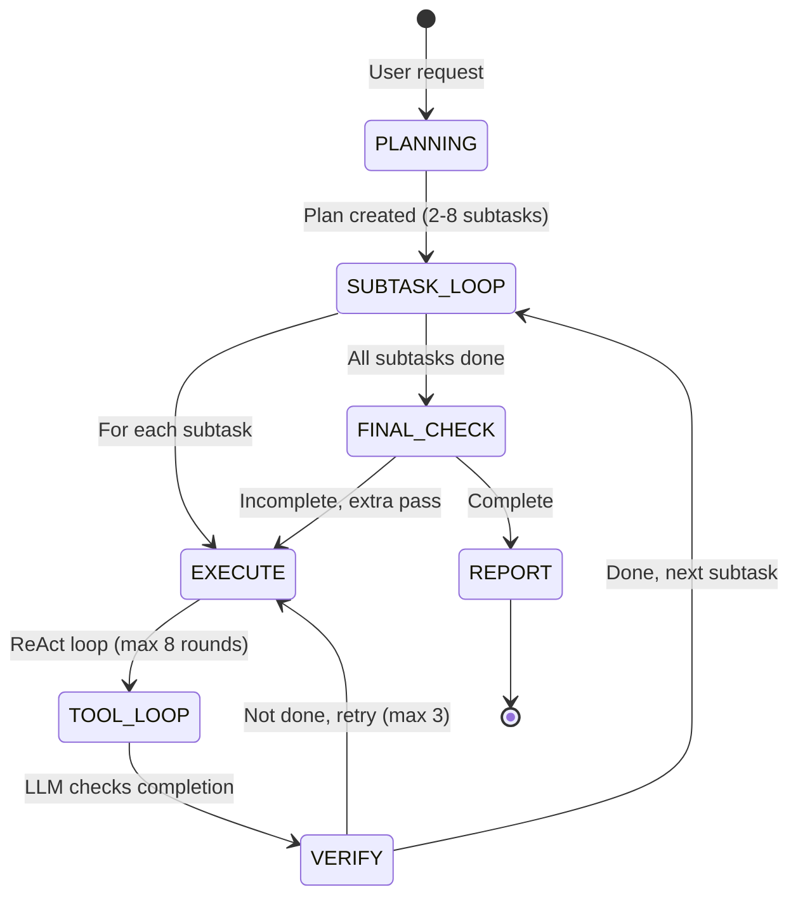
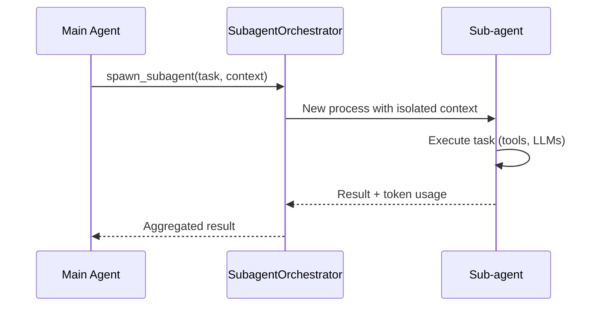

# Opsora CLI — Extensions Documentation

> **Bahasa Indonesia + English**  
> Dokumentasi lengkap 7 extensions/integrations Opsora CLI: agents, skills, commands, themes, plugins, MCP servers, dan integrasi eksternal.

---

## 📋 Extensions Overview | Ikhtisar Extensions

Opsora CLI memiliki **7 kategori extensions** yang memperluas fungsionalitas core:

| # | Extension | Type | Description |
|---|---|---|---|
| 1 | **Autonomous Agent** | Agent | Fully autonomous task execution dengan planning, verification, retry |
| 2 | **Sub-agent Orchestrator** | Agent | Parallel sub-agent spawning untuk task delegation |
| 3 | **Problem Solver** | Skill | 5-step problem solving framework (THINK→PLAN→ACT→VERIFY→REPORT) |
| 4 | **Plugin System** | Extension | Custom tool plugins via `~/.opsora/plugins/` |
| 5 | **Theme System** | Extension | 4 built-in themes + custom theme support |
| 6 | **MCP Integration** | Extension | 12 MCP servers untuk external tools |
| 7 | **Marketing Hub** | Integration | Social media automation (Telegram, Discord, content generation) |

---

## 🤖 1. Autonomous Agent (`opsora_agent.py`)

### Overview
Fully autonomous agent yang mendelegasikan task kompleks ke subtask, execute dengan ReAct loop, verify completion, dan retry on failure.

### Architecture



### Key Features

| Feature | Description |
|---|---|
| **Planning** | Decomposes request into 2-8 specific, actionable subtasks via LLM |
| **Execution** | ReAct tool-calling loop per subtask (max 8 rounds) |
| **Verification** | LLM verifies subtask actually complete before proceeding |
| **Retry Logic** | Up to 3 attempts with failure analysis & alternative approach |
| **Context Management** | Keeps last 10 messages per subtask for context |
| **Kill Switch** | `/abort` sets global flag to stop execution |
| **Progress Display** | Real-time todo-style progress in terminal |

### Usage

```bash
# In Opsora CLI
/solve "Refactor authentication module to use JWT with refresh tokens"

# Or programmatically
from opsora_agent import AutonomousAgent

agent = AutonomousAgent(
    invoke_fn=invoke_provider,
    execute_tool_fn=execute_tool,
    tools=SAFE_TOOLS,
    system_prompt=SYSTEM_PROMPT
)
result = agent.run(user_request, provider, model, history)
```

### Configuration

```python
# In agent initialization
agent = AutonomousAgent(
    max_subtask_rounds=8,      # Tool rounds per subtask
    # Subtask max attempts = 3 (hardcoded)
)
```

### Prompts (Indonesian)

```python
PLANNING_PROMPT = """Kamu adalah task planner. User meminta sesuatu dan kamu harus memecahnya jadi subtask konkret.

Aturan:
- Buat 2-8 subtask (jangan terlalu sedikit atau terlalu banyak)
- Setiap subtask harus spesifik dan actionable (bisa dikerjakan dalam 1-3 tool calls)
- Urutkan dari yang paling fundamental ke yang paling akhir
- Kalau task sederhana (< 2 langkah), buat 1-2 subtask saja
- JANGAN buat subtask "verifikasi" terpisah — verifikasi itu bagian dari setiap subtask

Return HANYA JSON array, tanpa teks lain:
[{"id": 1, "description": "..."}, {"id": 2, "description": "..."}]
"""
```

---

## 🤖 2. Sub-agent Orchestrator (`opsora_subagent.py`)

### Overview
Orkestrator untuk spawn sub-agent paralel yang bisa handle task delegation, research, code generation di background.

### Use Cases

| Scenario | Description |
|---|---|
| **Parallel File Analysis** | Analyze multiple files simultaneously |
| **Research Delegation** | Delegate web search to sub-agent |
| **Code Generation** | Generate boilerplate in background |
| **Test Generation** | Create tests for multiple modules |

### Architecture



### Usage

```python
from opsora_subagent import SubagentOrchestrator

orchestrator = SubagentOrchestrator(
    invoke_fn=invoke_provider,
    execute_tool_fn=execute_tool,
    tools=SAFE_TOOLS,
    system_prompt=SYSTEM_PROMPT
)

# Spawn sub-agent
result = orchestrator.spawn_subagent(
    task="Research best practices for JWT refresh token rotation",
    context={"project": "auth-service", "language": "python"}
)
```

### Configuration

```python
class SubagentOrchestrator:
    def __init__(
        self,
        invoke_fn: Callable,
        execute_tool_fn: Callable,
        tools: list[dict],
        system_prompt: str,
        max_parallel: int = 3,      # Max concurrent sub-agents
        timeout: int = 300          # Seconds per sub-agent
    ):
```

---

## 🧠 3. Problem Solver (`problem_solver.py`)

### Overview
5-step problem solving framework yang terintegrasi dengan agent loop untuk structured problem solving.

### The 5 Steps


| Step | Description | Tools Used |
|---|---|---|
| **THINK** | Analyze problem, constraints, context | `read_file`, `grep_search`, `workspace_status` |
| **PLAN** | List concrete executable steps | `todo_write` |
| **ACT** | Execute first step with real tools | Any tool |
| **VERIFY** | Validate correctness, safety, consistency | `run_tests`, `lint_check`, `grep_search` |
| **REPORT** | Summarize progress, declare next step | - |

### Usage

```bash
# In Opsora CLI
/solve "Database connection pool exhausted under load"

# Output:
# 🧠 THINK: Analyzing connection pool exhaustion...
# 📋 PLAN: 1. Check current pool config 2. Analyze query patterns 3. Implement pooling fix 4. Load test
# 🔧 ACT: Reading database config...
# ✅ VERIFY: Pool size increased, tests passing
# 📊 REPORT: Fixed connection pool exhaustion. Next: monitor production metrics.
```

### Integration with Agent

```python
# In opsora_agent.py
from problem_solver import solve_problem

# Used automatically for complex tasks
# Or invoked explicitly via /solve command
```

---

## 🔌 4. Plugin System (`opsora_plugins.py`)

### Overview
Sistem plugin untuk custom tools. Plugin diletakkan di `~/.opsora/plugins/` sebagai file Python.

### Plugin Structure

```python
# ~/.opsora/plugins/my_custom_tool.py
from opsora_plugins import OpsoraPlugin
from typing import Any

class MyCustomTool(OpsoraPlugin):
    name = "my_custom_tool"
    description = "Custom tool untuk specific use case"
    version = "1.0.0"

    def schema(self) -> dict:
        return {
            "type": "function",
            "function": {
                "name": "my_custom_tool",
                "description": "Deskripsi tool ini",
                "parameters": {
                    "type": "object",
                    "properties": {
                        "param1": {"type": "string", "description": "Parameter 1"},
                        "param2": {"type": "integer", "description": "Parameter 2", "default": 10}
                    },
                    "required": ["param1"]
                }
            }
        }

    def execute(self, args: dict[str, Any]) -> str:
        param1 = args.get("param1")
        param2 = args.get("param2", 10)
        
        # Your logic here
        result = do_something(param1, param2)
        return str(result)
```

### Discovery & Loading

```
~/.opsora/plugins/
├── my_tool.py          # ✅ Loaded as plugin
├── _private.py         # ❌ Ignored (underscore prefix)
├── another_tool.py     # ✅ Loaded as plugin
└── __pycache__/        # ❌ Ignored
```

```python
# Automatic discovery on startup
plugin_manager = PluginManager()
loaded = plugin_manager.discover()
# Returns: ["my_custom_tool", "another_tool"]

# Tools auto-added to SAFE_TOOLS
schemas = plugin_manager.get_schemas()
```

### Management Commands

```bash
# In Opsora CLI
/plugins              # List loaded plugins
/plugin-reload        # Hot reload plugins
/plugin-status        # Detailed plugin status
```

### Plugin API

```python
from opsora_plugins import (
    discover_plugins,
    get_plugin_schemas,
    execute_plugin,
    reload_plugins,
    plugin_status
)

# Discover
plugins = discover_plugins()

# Get schemas for LLM
schemas = get_plugin_schemas()

# Execute
result = execute_plugin("my_custom_tool", {"param1": "value"})

# Hot reload
reload_plugins()

# Status
status = plugin_status()
# {
#   "plugins_dir": "/root/.opsora/plugins",
#   "dir_exists": true,
#   "loaded_count": 2,
#   "plugins": {
#     "my_custom_tool": {"description": "...", "version": "1.0.0"}
#   }
# }
```

---

## 🎨 5. Theme System (`opsora_themes.py`)

### Overview
4 built-in themes dengan customizable color palettes untuk Rich console dan prompt-toolkit.

### Built-in Themes

| Theme | Name | Description | Best For |
|---|---|---|---|
| `dark` | **Dark Ocean** | Calm dark theme untuk late nights | Default, general use |
| `light` | **Light Paper** | Clean light theme untuk daylight | Bright environments |
| `cyber` | **Cyber Neon** | High contrast cyberpunk aesthetic | Presentations, demos |
| `warm` | **Warm Sunset** | Cozy warm tones untuk comfort | Long coding sessions |

### Color Palette Structure

```python
THEMES = {
    "dark": {
        "name": "Dark Ocean",
        "description": "Calm dark theme for late nights",
        "colors": {
            "accent": "#5fb8c0",
            "accent_bright": "#8fd8e8",
            "success": "#6abf69",
            "warning": "#d4a843",
            "error": "#d45555",
            "dim": "#6a6a7a",
            "prompt": "#5fb8c0",
            "border": "#3a3a4a",
            "bg": "#0d1117",
            "bg_secondary": "#161b22",
            "text": "#e6edf3",
            "text_secondary": "#8b949e",
            "tool_bg": "#161b22",
            "header": "#4a8fa8",
        }
    },
    # ... light, cyber, warm
}
```

### Usage

```bash
# In Opsora CLI
/theme              # List themes
/theme dark         # Switch to dark
/theme cyber        # Switch to cyber

# Keyboard shortcut
Ctrl+T              # Cycle themes
```

### Programmatic

```python
from opsora_themes import (
    apply_theme,
    get_theme,
    list_themes,
    get_current_theme,
    save_theme_preference,
    load_theme_preference
)

# Apply theme
apply_theme("cyber")

# Get current
current = get_current_theme()  # "cyber"

# List all
themes = list_themes()  # ["dark", "light", "cyber", "warm"]

# Persist preference
save_theme_preference("cyber")

# Load on startup
saved = load_theme_preference()  # "cyber"
apply_theme(saved)
```

### Custom Theme

```python
# Add to opsora_themes.py or create custom
CUSTOM_THEME = {
    "name": "My Theme",
    "description": "Custom theme",
    "colors": {
        "accent": "#ff6b35",
        "success": "#4ade80",
        "error": "#f87171",
        "bg": "#1a1a2e",
        "text": "#ffffff",
        # ... all required colors
    }
}

THEMES["my-theme"] = CUSTOM_THEME
apply_theme("my-theme")
```

---

## 🔌 6. MCP Integration (`opsora_mcp.py`)

### Overview
MCP (Model Context Protocol) client untuk menghubungkan ke 12 MCP servers (stdio + HTTP).

### Quick Reference

| Server | Transport | Tools | Use Case |
|---|---|---|---|
| GitHub | stdio | 16 | Issues, PRs, repos, code |
| Filesystem | stdio | 9 | Local file ops |
| SQLite | stdio | 4 | Database queries |
| Brave Search | stdio | 2 | Web search |
| Opsora API | HTTP | 4 | Gateway access |
| NVIDIA NGC | stdio | 4 | Model management |
| Discord | stdio | 4 | Discord bot |
| Google | stdio | 7 | Gmail, Calendar, Drive |
| Outlook | stdio | 4 | Email, Calendar |
| Telegram | stdio | 4 | Telegram bot |
| Gmail (Node) | stdio | 4 | Gmail advanced |
| Custom HTTP | HTTP | N | Custom MCP |

### Configuration

```json
// ~/.opsora/mcp.json
{
  "mcpServers": {
    "github": {
      "command": "npx",
      "args": ["-y", "@modelcontextprotocol/server-github"],
      "env": {"GITHUB_PERSONAL_ACCESS_TOKEN": "ghp_xxx"}
    },
    "filesystem": {
      "command": "npx",
      "args": ["-y", "@modelcontextprotocol/server-filesystem", "/root"]
    }
  }
}
```

### Usage

```bash
# In Opsora CLI
/status              # Shows MCP status
/tools               # Lists all tools including MCP
/mcp-connect github  # Connect specific server
/mcp-disconnect all  # Disconnect all
```

### Programmatic

```python
from opsora_mcp import MCPClient

client = MCPClient()
client.load_config()
connected = client.connect()

# Get tools for LLM
tools = client.to_openai_tools()

# Call tool directly
result = client.call_tool("mcp__github__create_issue", {
    "owner": "opsora",
    "repo": "opsora-cli",
    "title": "Test issue"
})

# Status table
table = client.render_status()
console.print(table)
```

---

## 📱 7. Marketing Hub (`marketing_hub/`)

### Overview
Social media automation system untuk content generation, scheduling, dan posting ke Telegram & Discord.

### Structure

```
marketing_hub/
├── hub.py              # Main orchestrator
├── content_engine.py   # AI content generation
├── telegram_poster.py  # Telegram posting
├── discord_poster.py   # Discord posting
└── config.py           # Configuration
```

### Content Engine

```python
from marketing_hub.content_engine import ContentEngine

engine = ContentEngine(
    provider="alibaba",
    model="qwen-plus",
    invoke_fn=invoke_provider
)

# Generate content
content = engine.generate(
    topic="Opsora CLI v3.1 release",
    platform="telegram",
    tone="technical",
    language="id"  # or "en"
)

# Output: Structured content with hashtags, formatting
```

### Telegram Poster

```python
from marketing_hub.telegram_poster import TelegramPoster

poster = TelegramPoster(
    bot_token="123456789:AAExxx",
    channel_id="@opsora_announcements"
)

# Post content
result = poster.post(
    content=content,
    parse_mode="HTML",
    disable_notification=False
)
```

### Discord Poster

```python
from marketing_hub.discord_poster import DiscordPoster

poster = DiscordPoster(
    webhook_url="https://discord.com/api/webhooks/xxx/yyy"
)

# Post with embed
result = poster.post(
    content=content,
    embed={
        "title": "Opsora CLI v3.1",
        "description": "New release with...",
        "color": 0x5fb8c0,
        "fields": [...]
    }
)
```

### Hub Orchestration

```python
from marketing_hub.hub import MarketingHub

hub = MarketingHub(config)

# Full pipeline: generate → review → schedule → post
campaign = hub.create_campaign(
    topic="Opsora CLI v3.1 Release",
    platforms=["telegram", "discord"],
    schedule="2026-08-03 10:00",
    languages=["id", "en"]
)

hub.execute_campaign(campaign)
```

### Configuration

```python
# marketing_hub/config.py
MARKETING_CONFIG = {
    "telegram": {
        "bot_token": os.environ.get("TELEGRAM_BOT_TOKEN"),
        "channels": {
            "announcements": "@opsora_announcements",
            "updates": "@opsora_updates",
            "indonesia": "@opsora_indonesia"
        }
    },
    "discord": {
        "webhooks": {
            "announcements": os.environ.get("DISCORD_WEBHOOK_ANNOUNCE"),
            "dev": os.environ.get("DISCORD_WEBHOOK_DEV")
        }
    },
    "content": {
        "default_provider": "alibaba",
        "default_model": "qwen-plus",
        "hashtags": ["#Opsora", "#AI", "#DeveloperTools"],
        "templates": {
            "release": "release_template.md",
            "blog": "blog_template.md",
            "tutorial": "tutorial_template.md"
        }
    }
}
```

---

## 🔧 Extension Development Guide

### Creating a New Agent

```python
# opsora_cmd/my_agent.py
from opsora_agent import AutonomousAgent, SubTask, AgentResult

class MySpecializedAgent(AutonomousAgent):
    """Agent specialized for specific domain."""
    
    def __init__(self, *args, domain: str = "general", **kwargs):
        super().__init__(*args, **kwargs)
        self.domain = domain
        self.system_prompt = self._get_domain_prompt()
    
    def _get_domain_prompt(self) -> str:
        return f"""Kamu adalah specialist di domain {self.domain}.
        Fokus pada best practices untuk {self.domain}.
        Gunakan tools yang relevan."""
    
    def plan(self, user_request: str, provider: str, model: str) -> list[SubTask]:
        # Custom planning logic
        return super().plan(user_request, provider, model)
```

### Creating a New Skill

```python
# opsora_cmd/my_skill.py
def my_skill_function(
    prompt: str,
    invoke_fn: Callable,
    execute_tool_fn: Callable,
    tools: list[dict],
    **kwargs
) -> str:
    """Skill description."""
    # Implementation
    return result

# Register in opsora_v2.py SLASH_COMMANDS
SLASH_COMMANDS = {
    "/myskill": my_skill_function,
    # ...
}
```

### Creating a Theme Extension

```python
# ~/.opsora/themes/my_theme.py
from opsora_themes import THEMES

THEMES["my-theme"] = {
    "name": "My Theme",
    "description": "Custom theme",
    "colors": {
        "accent": "#00ff00",
        "bg": "#000000",
        "text": "#ffffff",
        # ... all colors
    }
}
```

---

## 📋 Slash Commands Reference

| Command | Extension | Description |
|---|---|---|
| `/solve <problem>` | Problem Solver | 5-step problem solving |
| `/review [path]` | Agent | Code review |
| `/explain <file>` | Agent | Explain code |
| `/refactor <file>` | Agent | Refactor code |
| `/test [file]` | Agent | Generate & run tests |
| `/deploy [target]` | Agent | Deploy project |
| `/agent <task>` | Autonomous Agent | Run autonomous agent |
| `/subagent <task>` | Sub-agent | Spawn sub-agent |
| `/theme [name]` | Theme System | Switch theme |
| `/plugins` | Plugin System | List plugins |
| `/plugin-reload` | Plugin System | Reload plugins |
| `/mcp-connect <server>` | MCP | Connect MCP server |
| `/mcp-disconnect <server>` | MCP | Disconnect MCP server |
| `/marketing <topic>` | Marketing Hub | Generate marketing content |

---

## 📚 Related Documentation

| Document | Description |
|---|---|
| [README.md](README.md) | Quick start |
| [ARCHITECTURE.md](ARCHITECTURE.md) | System architecture |
| [MCP_SERVERS.md](MCP_SERVERS.md) | MCP server details |
| [PROVIDERS.md](PROVIDERS.md) | Provider configurations |
| [TROUBLESHOOTING.md](TROUBLESHOOTING.md) | Extension issues |
| [CONTRIBUTING.md](CONTRIBUTING.md) | Adding new extensions |

---

*Extensions documentation for Opsora CLI v3.1. Extend Opsora by adding plugins to `~/.opsora/plugins/` or creating new agents/skills in `opsora_cmd/`.*