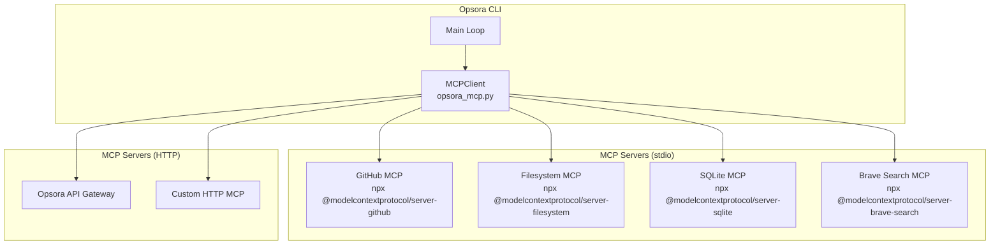

# Opsora CLI — MCP Servers Documentation

> **Bahasa Indonesia + English**  
> Dokumentasi lengkap 12 MCP (Model Context Protocol) servers yang terintegrasi dengan Opsora CLI: setup, konfigurasi, tools, dan troubleshooting.

---

## 📋 MCP Overview | Ikhtisar MCP

**Model Context Protocol (MCP)** adalah standar terbuka untuk menghubungkan LLM ke data sources dan tools eksternal. Opsora CLI mendukung MCP via **stdio** (subprocess) dan **HTTP/SSE** transport.

### Architecture



### Tool Naming Convention

```
mcp__{server_name}__{tool_name}
```

**Examples:**
- `mcp__github__create_issue`
- `mcp__filesystem__read_file`
- `mcp__sqlite__query`
- `mcp__brave__search`

---

## ⚙️ Configuration | Konfigurasi

### Config File: `~/.opsora/mcp.json`

```json
{
  "mcpServers": {
    "github": {
      "command": "npx",
      "args": ["-y", "@modelcontextprotocol/server-github"],
      "env": {
        "GITHUB_PERSONAL_ACCESS_TOKEN": "ghp_xxxxxxxxxxxx"
      }
    },
    "filesystem": {
      "command": "npx",
      "args": ["-y", "@modelcontextprotocol/server-filesystem", "/root"]
    },
    "sqlite": {
      "command": "npx",
      "args": ["-y", "@modelcontextprotocol/server-sqlite", "/root/.opsora/memory.db"]
    },
    "brave-search": {
      "command": "npx",
      "args": ["-y", "@modelcontextprotocol/server-brave-search"],
      "env": {
        "BRAVE_API_KEY": "BSA_xxxxxxxxxxxx"
      }
    },
    "opsora-api": {
      "url": "https://api.opsora.ai/mcp",
      "env": {
        "OPSORA_API_TOKEN": "ops_sk_xxxxxxxxxxxx"
      }
    }
  }
}
```

### Loading Config

```python
# In opsora_v2.py
mcp_client = MCPClient()
mcp_client.load_config()  # Loads ~/.opsora/mcp.json
connected = mcp_client.connect()  # Connect to all servers

# Get tools for LLM
tools = mcp_client.to_openai_tools()
```

---

## 🔌 The 12 MCP Servers | 12 MCP Server

### 1. GitHub MCP Server

**Package:** `@modelcontextprotocol/server-github`  
**Transport:** stdio  
**Auth:** GitHub Personal Access Token

#### Setup

```bash
# Install
npm install -g @modelcontextprotocol/server-github

# Create GitHub PAT (Settings → Developer settings → Personal access tokens)
# Scopes: repo, workflow, issues, pull_requests
```

#### Config

```json
{
  "github": {
    "command": "npx",
    "args": ["-y", "@modelcontextprotocol/server-github"],
    "env": {
      "GITHUB_PERSONAL_ACCESS_TOKEN": "ghp_xxxxxxxxxxxx"
    }
  }
}
```

#### Tools

| Tool | Description | Parameters |
|---|---|---|
| `create_issue` | Create GitHub issue | `owner`, `repo`, `title`, `body`, `labels`, `assignees` |
| `list_issues` | List repository issues | `owner`, `repo`, `state`, `labels`, `per_page` |
| `get_issue` | Get issue details | `owner`, `repo`, `issue_number` |
| `update_issue` | Update issue | `owner`, `repo`, `issue_number`, `title`, `body`, `state` |
| `add_issue_comment` | Comment on issue | `owner`, `repo`, `issue_number`, `body` |
| `create_pull_request` | Create PR | `owner`, `repo`, `title`, `body`, `head`, `base` |
| `list_pull_requests` | List PRs | `owner`, `repo`, `state`, `per_page` |
| `get_pull_request` | Get PR details | `owner`, `repo`, `pull_number` |
| `merge_pull_request` | Merge PR | `owner`, `repo`, `pull_number`, `merge_method` |
| `create_repository` | Create new repo | `name`, `description`, `private`, `auto_init` |
| `fork_repository` | Fork repository | `owner`, `repo`, `organization` |
| `search_repositories` | Search repos | `query`, `per_page` |
| `search_code` | Search code | `query`, `per_page` |
| `get_file_contents` | Get file content | `owner`, `repo`, `path`, `ref` |
| `create_or_update_file` | Create/update file | `owner`, `repo`, `path`, `content`, `message`, `branch` |
| `delete_file` | Delete file | `owner`, `repo`, `path`, `message`, `branch` |
| `list_commits` | List commits | `owner`, `repo`, `sha`, `path`, `per_page` |

#### Usage in Opsora

```
> Buat issue di repo opsora/opsora-cli: "Bug: auto-routing tidak work untuk vision"
🔧 mcp__github__create_issue (owner=opsora, repo=opsora-cli, title="Bug: auto-routing tidak work untuk vision", body="...")
✓ Issue created: #1234
```

---

### 2. Filesystem MCP Server

**Package:** `@modelcontextprotocol/server-filesystem`  
**Transport:** stdio  
**Auth:** None (local filesystem access)

#### Setup

```bash
npm install -g @modelcontextprotocol/server-filesystem
```

#### Config

```json
{
  "filesystem": {
    "command": "npx",
    "args": ["-y", "@modelcontextprotocol/server-filesystem", "/root", "/home/user/projects"]
  }
}
```

#### Tools

| Tool | Description | Parameters |
|---|---|---|
| `read_file` | Read file content | `path` |
| `write_file` | Write file | `path`, `content` |
| `edit_file` | Edit file (patch) | `path`, `old_text`, `new_text` |
| `list_directory` | List directory | `path` |
| `create_directory` | Create directory | `path` |
| `delete_file` | Delete file | `path` |
| `move_file` | Move/rename file | `source`, `destination` |
| `search_files` | Search files | `path`, `pattern` |
| `get_file_info` | Get file metadata | `path` |

#### Usage

```
> Baca file /root/opsora-cli/README.md
🔧 mcp__filesystem__read_file (path=/root/opsora-cli/README.md)
✓ File content: # Opsora CLI...
```

---

### 3. SQLite MCP Server

**Package:** `@modelcontextprotocol/server-sqlite`  
**Transport:** stdio  
**Auth:** None (local database)

#### Setup

```bash
npm install -g @modelcontextprotocol/server-sqlite
```

#### Config

```json
{
  "sqlite": {
    "command": "npx",
    "args": ["-y", "@modelcontextprotocol/server-sqlite", "/root/.opsora/memory.db"]
  }
}
```

#### Tools

| Tool | Description | Parameters |
|---|---|---|
| `query` | Execute SELECT query | `sql` |
| `execute` | Execute INSERT/UPDATE/DELETE | `sql` |
| `list_tables` | List all tables | - |
| `describe_table` | Get table schema | `table` |

#### Usage

```
> Query memory database: SELECT * FROM memories LIMIT 5
🔧 mcp__sqlite__query (sql=SELECT * FROM memories LIMIT 5)
✓ Results: [{"id": 1, "text": "User prefers...", "source": "cli", "created_at": 1722567890}]
```

---

### 4. Brave Search MCP Server

**Package:** `@modelcontextprotocol/server-brave-search`  
**Transport:** stdio  
**Auth:** Brave Search API Key

#### Setup

```bash
npm install -g @modelcontextprotocol/server-brave-search

# Get API key: https://brave.com/search/api/
```

#### Config

```json
{
  "brave-search": {
    "command": "npx",
    "args": ["-y", "@modelcontextprotocol/server-brave-search"],
    "env": {
      "BRAVE_API_KEY": "BSA_xxxxxxxxxxxx"
    }
  }
}
```

#### Tools

| Tool | Description | Parameters |
|---|---|---|
| `search` | Web search | `query`, `count`, `offset`, `search_lang` |
| `news_search` | News search | `query`, `count`, `offset`, `freshness` |

#### Usage

```
> Cari "opsora cli multi provider" di web
🔧 mcp__brave-search__search (query="opsora cli multi provider", count=10)
✓ Results: 1. GitHub repo... 2. Documentation...
```

---

### 5. Opsora API Gateway MCP

**Transport:** HTTP  
**Auth:** Bearer Token

#### Config

```json
{
  "opsora-api": {
    "url": "https://api.opsora.ai/mcp",
    "env": {
      "OPSORA_API_TOKEN": "ops_sk_xxxxxxxxxxxx"
    }
  }
}
```

#### Tools

| Tool | Description | Parameters |
|---|---|---|
| `chat_completion` | Chat via Opsora Gateway | `messages`, `model`, `provider`, `stream` |
| `list_models` | List available models | - |
| `get_usage` | Get usage stats | `period` |
| `route_prompt` | Smart route prompt | `prompt`, `prefer_cost`, `prefer_speed` |

---

### 6. NVIDIA NGC MCP

**File:** `opsora_cmd/nvidia_ngc_mcp.py`  
**Transport:** stdio (Python)  
**Auth:** NVIDIA API Key

#### Config

```json
{
  "nvidia-ngc": {
    "command": "python",
    "args": ["-m", "opsora_cmd.nvidia_ngc_mcp"],
    "env": {
      "NVIDIA_API_KEY": "nvapi_xxxxxxxxxxxx"
    }
  }
}
```

#### Tools

| Tool | Description | Parameters |
|---|---|---|
| `list_models` | List NVIDIA NIM models | - |
| `get_model_info` | Get model details | `model_id` |
| `deploy_model` | Deploy model to NGC | `model_id`, `instance_type`, `replicas` |
| `get_deployment_status` | Check deployment | `deployment_id` |

---

### 7. Discord REST MCP

**File:** `opsora_cmd/discord_rest_mcp.py`  
**Transport:** stdio (Python)  
**Auth:** Discord Bot Token

#### Config

```json
{
  "discord": {
    "command": "python",
    "args": ["-m", "opsora_cmd.discord_rest_mcp"],
    "env": {
      "DISCORD_BOT_TOKEN": "MTxxxxxxxxxxxx.xxxxxx.xxxxxxxxxxxxxxxx",
      "DISCORD_CHANNEL_ID": "123456789012345678"
    }
  }
}
```

#### Tools

| Tool | Description | Parameters |
|---|---|---|
| `send_message` | Send message to channel | `content`, `embed` |
| `get_messages` | Fetch recent messages | `limit`, `before` |
| `create_thread` | Create thread | `name`, `message_id` |
| `add_reaction` | Add reaction | `message_id`, `emoji` |

---

### 8. Google Services MCP

**File:** `opsora_cmd/opsora_google_mcp.py`  
**Transport:** stdio (Python)  
**Auth:** Google OAuth2

#### Config

```json
{
  "google": {
    "command": "python",
    "args": ["-m", "opsora_cmd.opsora_google_mcp"],
    "env": {
      "GOOGLE_CLIENT_ID": "xxxxxxxxxx.apps.googleusercontent.com",
      "GOOGLE_CLIENT_SECRET": "GOCSPX-xxxxxxxxxxxx",
      "GOOGLE_REFRESH_TOKEN": "1//xxxxxxxxxxxxxxxxx"
    }
  }
}
```

#### Tools

| Tool | Description | Parameters |
|---|---|---|
| `gmail_search` | Search Gmail | `query`, `max_results` |
| `gmail_send` | Send email | `to`, `subject`, `body`, `attachments` |
| `calendar_list_events` | List calendar events | `calendar_id`, `time_min`, `time_max` |
| `calendar_create_event` | Create event | `calendar_id`, `summary`, `start`, `end`, `attendees` |
| `drive_list_files` | List Drive files | `query`, `page_size` |
| `drive_upload` | Upload to Drive | `file_path`, `folder_id` |
| `contacts_search` | Search contacts | `query`, `max_results` |

---

### 9. Outlook MCP

**File:** `opsora_cmd/outlook_mcp.py`  
**Transport:** stdio (Python)  
**Auth:** Microsoft Graph OAuth2

#### Config

```json
{
  "outlook": {
    "command": "python",
    "args": ["-m", "opsora_cmd.outlook_mcp"],
    "env": {
      "OUTLOOK_CLIENT_ID": "xxxxxxxx-xxxx-xxxx-xxxx-xxxxxxxxxxxx",
      "OUTLOOK_CLIENT_SECRET": "xxxxxxxxxxxxxxxxxxxx",
      "OUTLOOK_TENANT_ID": "xxxxxxxx-xxxx-xxxx-xxxx-xxxxxxxxxxxx",
      "OUTLOOK_REFRESH_TOKEN": "0.xxxxxxxxxxxxxxxxxxxx"
    }
  }
}
```

#### Tools

| Tool | Description | Parameters |
|---|---|---|
| `mail_search` | Search emails | `query`, `top` |
| `mail_send` | Send email | `to`, `subject`, `body` |
| `calendar_list` | List calendar events | `start`, `end` |
| `calendar_create` | Create event | `subject`, `start`, `end`, `attendees` |

---

### 10. Telegram MCP

**File:** `opsora_cmd/telegram_mcp_server.py`  
**Transport:** stdio (Python)  
**Auth:** Telegram Bot Token

#### Config

```json
{
  "telegram": {
    "command": "python",
    "args": ["-m", "opsora_cmd.telegram_mcp_server"],
    "env": {
      "TELEGRAM_BOT_TOKEN": "123456789:AAExxxxxxxxxxxxxxxxxxxxxxxx",
      "TELEGRAM_CHAT_ID": "123456789"
    }
  }
}
```

#### Tools

| Tool | Description | Parameters |
|---|---|---|
| `send_message` | Send message | `chat_id`, `text`, `parse_mode` |
| `get_updates` | Get bot updates | `offset`, `limit` |
| `get_chat` | Get chat info | `chat_id` |
| `send_photo` | Send photo | `chat_id`, `photo`, `caption` |

---

### 11. Gmail MCP (Node.js)

**File:** `opsora_cmd/opsora_gmail.js`  
**Transport:** stdio (Node.js)  
**Auth:** Google OAuth2

#### Config

```json
{
  "gmail": {
    "command": "node",
    "args": ["opsora_cmd/opsora_gmail.js"],
    "env": {
      "GOOGLE_CLIENT_ID": "xxxxxxxxxx.apps.googleusercontent.com",
      "GOOGLE_CLIENT_SECRET": "GOCSPX-xxxxxxxxxxxx",
      "GOOGLE_REFRESH_TOKEN": "1//xxxxxxxxxxxxxxxxx"
    }
  }
}
```

#### Tools

| Tool | Description | Parameters |
|---|---|---|
| `search_emails` | Search Gmail | `query`, `max_results` |
| `send_email` | Send email | `to`, `subject`, `body`, `cc`, `bcc` |
| `list_labels` | List Gmail labels | - |
| `modify_labels` | Add/remove labels | `message_id`, `add_labels`, `remove_labels` |

---

### 12. Custom HTTP MCP

**Template** untuk MCP server custom via HTTP

#### Config

```json
{
  "my-custom-mcp": {
    "url": "https://my-mcp-server.com/mcp",
    "env": {
      "CUSTOM_API_KEY": "sk-xxxxxxxxxxxx"
    }
  }
}
```

#### Required Endpoints

```
GET  /mcp/tools          - List tools
POST /mcp/tools/call     - Call tool
GET  /mcp/resources      - List resources
POST /mcp/resources/read - Read resource
```

#### Response Format

```json
// GET /mcp/tools
{
  "tools": [
    {
      "name": "my_tool",
      "description": "Tool description",
      "inputSchema": {
        "type": "object",
        "properties": {
          "param1": {"type": "string"}
        },
        "required": ["param1"]
      }
    }
  ]
}

// POST /mcp/tools/call
{
  "name": "my_tool",
  "arguments": {"param1": "value"}
}

// Response
{
  "content": [
    {"type": "text", "text": "Tool result"}
  ]
}
```

---

## 🛠️ Usage in Opsora CLI

### Connect to MCP Servers

```bash
# In Opsora CLI session
/status
# Shows MCP servers status

# Or programmatically
mcp_client = MCPClient()
mcp_client.load_config()
connected = mcp_client.connect()
```

### List Available MCP Tools

```bash
# In Opsora CLI
/tools
# Shows all tools including MCP tools

# Or
/mcp-tools
```

### Call MCP Tool

```bash
# Direct tool call via slash command
/mcp github create_issue --owner opsora --repo opsora-cli --title "Test"

# Or let LLM call it naturally
> Buat issue di GitHub untuk bug auto-routing
🤖 LLM calls mcp__github__create_issue automatically
```

### Tool Discovery

```python
# Get all MCP tools as OpenAI function schemas
tools = mcp_client.to_openai_tools()

# Example output:
[
  {
    "type": "function",
    "function": {
      "name": "mcp__github__create_issue",
      "description": "Create a new issue in a GitHub repository",
      "parameters": {
        "type": "object",
        "properties": {
          "owner": {"type": "string"},
          "repo": {"type": "string"},
          "title": {"type": "string"},
          "body": {"type": "string"}
        },
        "required": ["owner", "repo", "title"]
      }
    }
  }
]
```

---

## 🔧 Troubleshooting | Troubleshooting

### Common Issues

| Issue | Cause | Solution |
|---|---|---|
| `MCP server 'github' not connected` | PAT invalid/expired | Regenerate GitHub PAT with correct scopes |
| `Command not found: npx` | Node.js not installed | Install Node.js: `apt install nodejs npm` |
| `EACCES: permission denied` | npm global install permissions | Use `npx -y` or fix npm permissions |
| `Connection refused` (HTTP) | Server down/wrong URL | Check server status, verify URL |
| `401 Unauthorized` | Invalid API key | Regenerate API key, update config |
| `Timeout` | Server slow to start | Increase timeout, check server logs |

### Debug Mode

```bash
# Enable verbose MCP logging
OPSORA_VERBOSE=true opsora

# Or in session
/verbose
```

### Check Server Status

```bash
# In Opsora CLI
/status

# Output:
# 🔌 MCP Servers
# ┌──────────────┬──────────┬────────────┬───────┐
# │ Server       │ Transport│ Status     │ Tools │
# ├──────────────┼──────────┼────────────┼───────┤
# │ github       │ stdio    │ 🟢 connected│ 16   │
# │ filesystem   │ stdio    │ 🟢 connected│ 9    │
# │ sqlite       │ stdio    │ 🟢 connected│ 4    │
# │ brave-search │ stdio    │ 🔴 disconnected│ 0  │
# └──────────────┴──────────┴────────────┴───────┘
```

### Reconnect Specific Server

```python
# In Python
mcp_client.connect("github")  # Reconnect only github
```

### View Server Logs

```bash
# For stdio servers, check stderr
# Logs appear in Opsora console with [MCP] prefix

# For HTTP servers, check server logs directly
```

---

## 🔒 Security Best Practices

### Token Management

```bash
# Use environment variables, not config file
export GITHUB_PERSONAL_ACCESS_TOKEN=ghp_xxx
export BRAVE_API_KEY=BSA_xxx

# In mcp.json, reference env vars
{
  "github": {
    "command": "npx",
    "args": ["-y", "@modelcontextprotocol/server-github"],
    "env": {
      "GITHUB_PERSONAL_ACCESS_TOKEN": "${GITHUB_PERSONAL_ACCESS_TOKEN}"
    }
  }
}
```

### Scope Minimization

| Server | Minimum Scopes |
|---|---|
| GitHub | `repo`, `issues`, `pull_requests` |
| Google | `gmail.readonly`, `calendar.readonly` |
| Discord | `bot`, `messages.read`, `channels.read` |
| Telegram | Bot token only |

### Network Isolation

```json
{
  "filesystem": {
    "command": "npx",
    "args": ["-y", "@modelcontextprotocol/server-filesystem", "/root/workspace"]
  }
}
```
**Only expose necessary directories.**

---

## 📚 Related Documentation

| Document | Description |
|---|---|
| [README.md](README.md) | Quick start |
| [ARCHITECTURE.md](ARCHITECTURE.md) | MCP integration architecture |
| [EXTENSIONS.md](EXTENSIONS.md) | Extensions & agents |
| [PROVIDERS.md](PROVIDERS.md) | Provider configurations |
| [TROUBLESHOOTING.md](TROUBLESHOOTING.md) | General troubleshooting |

---

*MCP servers documentation for Opsora CLI v3.1. Add new servers by updating `~/.opsora/mcp.json` and this documentation.*