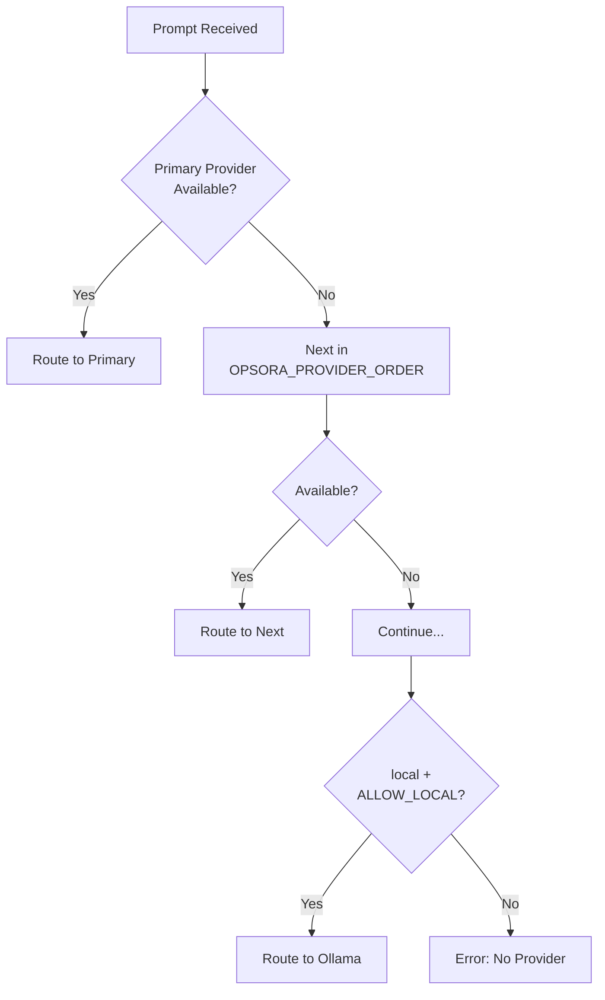

# Opsora CLI — Provider Configurations & Models

> **Bahasa Indonesia + English**  
> Dokumentasi lengkap semua provider AI yang didukung, model-modelnya, konfigurasi, pricing, dan routing rules.

---

## 📋 Provider Overview | Ikhtisar Provider

Opsora CLI mendukung **7 provider AI** melalui OpenAI-compatible APIs:

| # | Provider | Type | Models | Protocol | Status |
|---|---|---|---|---|---|
| 1 | **NVIDIA NIM** | Cloud | 11 | OpenAI-compatible | ✅ Production |
| 2 | **Alibaba DashScope** | Cloud | 6 | OpenAI-compatible | ✅ Production |
| 3 | **OpenAI** | Cloud | 2 | OpenAI API | ✅ Production |
| 4 | **AWS Bedrock** | Cloud | 2 | AWS Converse API | ✅ Production |
| 5 | **Tencent TokenHub** | Cloud | 4 | OpenAI-compatible | ✅ Production |
| 6 | **Ollama (Local)** | Local | Unlimited | OpenAI-compatible | ✅ Production |
| 7 | **Model Studio** | Regional | 2 | OpenAI-compatible | ⚠️ Regional |

---

## 🟢 1. NVIDIA NIM

### Overview
NVIDIA NIM (NVIDIA Inference Microservices) menyediakan model-model open-source yang dioptimasi untuk GPU NVIDIA dengan latency rendah.

### Configuration

```bash
# ~/.opsora_env
NVIDIA_API_KEY=nvapi-xxxxxxxxxxxxxxxxxxxx
```

**Get API Key:** https://build.nvidia.com/ (NVIDIA NGC account required)

### Models (Verified Working 2026-07-31)

| Model ID | Size | Type | Latency (avg) | Best For |
|---|---|---|---|---|
| `nvidia/nemotron-3-ultra-550b-a55b` | 550B MoE | Flagship | 1.7s | Complex reasoning, analysis |
| `mistralai/mistral-medium-3.5-128b` | 128B | General | 1.2s | Balanced performance |
| `nvidia/nemotron-3-super-120b-a12b` | 120B MoE | Flagship | 1.1s | High-quality generation |
| `meta/llama-3.1-70b-instruct` | 70B | General | 1.1s | Reliable all-rounder |
| `nvidia/llama-3.3-nemotron-super-49b-v1.5` | 49B | Enhanced | 2.1s | Coding, reasoning |
| `nvidia/nemotron-3-nano-30b-a3b` | 30B MoE | Efficient | 1.5s | Fast with quality |
| `nvidia/nvidia-nemotron-nano-9b-v2` | 9B | Compact | 1.5s | Edge deployment |
| `mistralai/mistral-nemotron` | ~12B | Collaboration | 1.1s | Balanced |
| `stepfun-ai/step-3.7-flash` | ~7B | Fast | 1.6s | Quick responses |
| `nvidia/nemotron-mini-4b-instruct` | 4B | Ultra-fast | 1.1s | Speed-critical tasks |
| `meta/llama-3.1-8b-instruct` | 8B | Fastest | 0.8s | Ultra-low latency |

### Model Tiers (Auto-Routing)

```python
POWER_MODELS = [
    ("nvidia", "nvidia/nemotron-3-ultra-550b-a55b"),
    ("nvidia", "mistralai/mistral-medium-3.5-128b"),
    ("nvidia", "nvidia/nemotron-3-super-120b-a12b"),
    ("nvidia", "meta/llama-3.1-70b-instruct"),
]

FAST_MODELS = [
    ("nvidia", "nvidia/nemotron-mini-4b-instruct"),
    ("nvidia", "mistralai/mistral-nemotron"),
    ("nvidia", "meta/llama-3.1-8b-instruct"),
    ("nvidia", "stepfun-ai/step-3.7-flash"),
]

REASONING_MODELS = [
    ("nvidia", "nvidia/nemotron-3-ultra-550b-a55b"),
    ("nvidia", "nvidia/nemotron-3-super-120b-a12b"),
    ("nvidia", "nvidia/nemotron-3-nano-30b-a3b"),
]

CODING_MODELS = [
    ("nvidia", "meta/llama-3.1-70b-instruct"),
    ("nvidia", "nvidia/llama-3.3-nemotron-super-49b-v1.5"),
    ("nvidia", "mistralai/mistral-nemotron"),
]
```

### Pricing (Per 1M Tokens)

| Model | Input | Output |
|---|---|---|
| Nemotron 3 Ultra 550B | $0.00* | $0.00* |
| Mistral Medium 3.5 128B | $0.00* | $0.00* |
| Nemotron 3 Super 120B | $0.00* | $0.00* |
| Llama 3.1 70B | $0.00* | $0.00* |
| *NVIDIA NIM free tier (rate limited) | | |

### Base URL & Limits

```python
BASE_URL = "https://integrate.api.nvidia.com/v1"
TIMEOUT = 40  # seconds
MAX_CONTEXT = 131_072  # tokens (varies by model)
RATE_LIMIT = "100 req/min (free tier)"
```

### Troubleshooting

| Issue | Solution |
|---|---|
| `401 Unauthorized` | Verify `NVIDIA_API_KEY` valid, check NGC account |
| `429 Rate Limited` | Wait, implement backoff, or upgrade NGC tier |
| `503 Service Unavailable` | Model temporarily down, try another model |
| High latency | Use smaller model (4B, 8B) for speed |

---

## 🟠 2. Alibaba DashScope (Qwen)

### Overview
DashScope adalah platform AI Alibaba Cloud dengan model Qwen series yang kuat untuk coding, reasoning, dan multilingual.

### Configuration

```bash
# ~/.opsora_env
DASHSCOPE_API_KEY=sk-xxxxxxxxxxxxxxxxxxxx
# Optional custom base URL
ALIBABA_BASE_URL=https://dashscope-intl.aliyuncs.com/compatible-mode/v1
```

**Get API Key:** https://dashscope.console.aliyun.com/ (Alibaba Cloud account required)

### Models

| Model ID | Size | Type | Latency (avg) | Best For |
|---|---|---|---|---|
| `qwen-max` | ~72B+ | Flagship | 1.2s | Complex reasoning, analysis, creative |
| `qwen-plus` | ~30B | Balanced | 1.4s | General purpose, coding |
| `qwen-turbo` | ~7B | Fast | 0.9s | Quick responses, simple tasks |
| `qwen3-coder-plus` | ~30B | Coding | 1.3s | Code generation, debugging |
| `qwen3-coder-flash` | ~7B | Coding Fast | 1.3s | Fast code tasks |
| `qwen3.7-max` | ~72B+ | Reasoning | 3.1s | Deep reasoning, analysis |
| `qwen3.7-plus` | ~30B | Reasoning | 4.1s | Balanced reasoning |
| `qwen3.7-flash` | ~7B | Reasoning Fast | 1.9s | Quick reasoning |

### Model Tiers

```python
POWER_MODELS = [
    ("alibaba", "qwen-max"),
    ("alibaba", "qwen3.7-max"),
]

FAST_MODELS = [
    ("alibaba", "qwen3-coder-flash"),
    ("alibaba", "qwen-plus"),
    ("alibaba", "qwen3.7-flash"),
    ("alibaba", "qwen-turbo"),
]

REASONING_MODELS = [
    ("alibaba", "qwen3.7-max"),
    ("alibaba", "qwen3.7-plus"),
]

CODING_MODELS = [
    ("alibaba", "qwen3-coder-flash"),
    ("alibaba", "qwen-plus"),
    ("alibaba", "qwen3-coder-plus"),
]
```

### Pricing (Per 1M Tokens)

| Model | Input | Output |
|---|---|---|
| `qwen-max` | $2.00 | $6.00 |
| `qwen-plus` | $0.40 | $1.20 |
| `qwen-turbo` | $0.05 | $0.20 |
| `qwen3-coder-plus` | $0.40 | $1.20 |
| `qwen3-coder-flash` | $0.15 | $0.60 |
| `qwen3.7-max` | $1.50 | $4.50 |
| `qwen3.7-plus` | $0.40 | $1.20 |
| `qwen3.7-flash` | $0.10 | $0.30 |

### Base URL & Limits

```python
BASE_URL = "https://dashscope-intl.aliyuncs.com/compatible-mode/v1"
# Regional (China): "https://dashscope.aliyuncs.com/compatible-mode/v1"
TIMEOUT = 40
MAX_CONTEXT = 1_000_000  # 1M tokens for Qwen models
RATE_LIMIT = "600 req/min (pay-as-you-go)"
```

### Regional Notes

- **International:** `dashscope-intl.aliyuncs.com` — global access
- **China Mainland:** `dashscope.aliyuncs.com` — requires ICP license
- **Model Studio (SEA):** Separate endpoint for Southeast Asia

---

## 🔵 3. OpenAI

### Configuration

```bash
# ~/.opsora_env
OPENAI_API_KEY=sk-xxxxxxxxxxxxxxxxxxxxxxxx
```

**Get API Key:** https://platform.openai.com/api-keys

### Models

| Model ID | Size | Type | Context | Best For |
|---|---|---|---|---|
| `gpt-4o` | Flagship | Multimodal | 128k | Best overall quality |
| `gpt-4o-mini` | Compact | Multimodal | 128k | Cost-effective quality |

### Pricing (Per 1M Tokens)

| Model | Input | Output |
|---|---|---|
| `gpt-4o` | $5.00 | $15.00 |
| `gpt-4o-mini` | $0.15 | $0.60 |

### Base URL & Limits

```python
BASE_URL = "https://api.openai.com/v1"
TIMEOUT = 40
MAX_CONTEXT = 128_000
RATE_LIMIT = "Tier-based (check OpenAI dashboard)"
```

---

## ☁️ 4. AWS Bedrock

### Configuration

```bash
# ~/.opsora_env
AWS_PROFILE=default
AWS_DEFAULT_REGION=us-east-1
# Or use environment variables
AWS_ACCESS_KEY_ID=AKIA...
AWS_SECRET_ACCESS_KEY=...
```

**Setup:** AWS CLI configured with Bedrock access: `aws configure`

### Models

| Model ID | Provider | Type | Context | Best For |
|---|---|---|---|---|
| `amazon.nova-pro-v1:0` | Amazon | Flagship | 300k | Complex reasoning, analysis |
| `amazon.nova-lite-v1:0` | Amazon | Fast | 300k | Quick tasks, cost optimization |

### Pricing (Per 1M Tokens) — us-east-1

| Model | Input | Output |
|---|---|---|
| `nova-pro` | $0.80 | $3.20 |
| `nova-lite` | $0.06 | $0.24 |

### Base URL & Limits

```python
# Uses AWS Converse API (not OpenAI-compatible)
SERVICE = "bedrock-runtime"
REGION = "us-east-1"  # or configured region
TIMEOUT = 60  # Bedrock can be slower
MAX_CONTEXT = 300_000
```

### IAM Policy Required

```json
{
  "Version": "2012-10-17",
  "Statement": [
    {
      "Effect": "Allow",
      "Action": [
        "bedrock:InvokeModel",
        "bedrock:InvokeModelWithResponseStream"
      ],
      "Resource": [
        "arn:aws:bedrock:us-east-1::foundation-model/amazon.nova-pro-v1:0",
        "arn:aws:bedrock:us-east-1::foundation-model/amazon.nova-lite-v1:0"
      ]
    }
  ]
}
```

---

## 🔴 5. Tencent TokenHub

### Configuration

```bash
# ~/.opsora_env
TOKENHUB_API_KEY=your-tokenhub-key
```

**Get API Key:** https://tokenhub.tencentmaas.com/ (Tencent Cloud account required)

### Models

| Model ID | Provider | Type | Best For |
|---|---|---|---|
| `hy3` | Hunyuan | General | Chinese tasks, general |
| `kimi-k3` | Moonshot | Long context | Document analysis, long-form |
| `glm-5` | Zhipu | Reasoning | Complex reasoning |
| `deepseek-v4-flash` | DeepSeek | Fast/Coding | Code, fast responses |

### Pricing (Per 1M Tokens)

| Model | Input | Output |
|---|---|---|
| `hy3` | $0.132 | $0.132 |
| `kimi-k3` | $0.20 | $0.60 |
| `glm-5` | ~$0.50 | ~$1.50 |
| `deepseek-v4-flash` | $0.02 | $0.02 |

### Base URL & Limits

```python
BASE_URL = "https://tokenhub.tencentmaas.com/v1"
TIMEOUT = 40
MAX_CONTEXT = 131_072  # varies by model
RATE_LIMIT = "Check Tencent console"
```

---

## 🟣 6. Ollama (Local/Offline)

### Configuration

```bash
# ~/.opsora_env
OPSORA_OLLAMA_URL=http://127.0.0.1:11434/v1
OPSORA_ALLOW_LOCAL_FALLBACK=true
OPSORA_PROVIDER_ORDER=local,alibaba,nvidia  # local first for offline
```

**Install Ollama:** https://ollama.com/download

### Popular Models to Pull

```bash
# Coding
ollama pull qwen2.5-coder:32b
ollama pull codellama:34b
ollama pull deepseek-coder:33b

# General
ollama pull qwen2.5:72b
ollama pull llama3.1:70b
ollama pull mistral:7b

# Reasoning
ollama pull qwen2.5:72b-instruct
ollama pull nemotron3:8b

# Lightweight (for low RAM)
ollama pull qwen2.5:7b
ollama pull llama3.1:8b
ollama pull phi3:3.8b
```

### Models Available

| Model | Size | RAM Required | Best For |
|---|---|---|---|
| `qwen2.5:72b` | 72B | 48 GB | Best local quality |
| `llama3.1:70b` | 70B | 48 GB | Strong reasoning |
| `qwen2.5-coder:32b` | 32B | 24 GB | Best local coding |
| `deepseek-coder:33b` | 33B | 24 GB | Code generation |
| `qwen2.5:14b` | 14B | 12 GB | Balanced |
| `mistral:7b` | 7B | 8 GB | Fast, efficient |
| `qwen2.5:7b` | 7B | 8 GB | Multilingual |
| `phi3:3.8b` | 3.8B | 4 GB | Ultra-lightweight |

### Pricing

**Free** — Runs on your hardware. Only electricity cost.

### Base URL & Limits

```python
BASE_URL = "http://127.0.0.1:11434/v1"  # Default
TIMEOUT = 120  # Local can be slower on first load
MAX_CONTEXT = 131_072  # Depends on model
RATE_LIMIT = "Hardware limited"
```

### GPU Acceleration

```bash
# NVIDIA GPU
ollama serve  # Auto-detects CUDA

# Apple Silicon
ollama serve  # Uses Metal

# AMD ROCm
OLLAMA_ROCM=1 ollama serve
```

---

## 🟡 7. Model Studio (Alibaba Regional)

### Configuration

```bash
# ~/.opsora_env
DASHSCOPE_API_KEY=sk-xxxxxxxxxxxxxxxxxxxx
# Uses same key as DashScope
```

**Region:** Southeast Asia (Singapore)

### Models

| Model ID | Type | Context |
|---|---|---|
| `qwen-plus` | Balanced | 1M tokens |
| `qwen-max` | Flagship | 1M tokens |

### Base URL

```python
BASE_URL = "https://ws-u05t2ivr4fghrt6v.ap-southeast-1.maas.aliyuncs.com/compatible-mode/v1"
```

---

## ⚙️ Provider Priority & Fallback

### Environment Variable

```bash
# ~/.opsora_env
OPSORA_PROVIDER_ORDER=nvidia,alibaba,tokenhub,bedrock,openai,local
OPSORA_ALLOW_LOCAL_FALLBACK=true
```

### Fallback Logic



### Checking Provider Status

```bash
# In Opsora CLI
/status

# Output:
# Provider Status:
#   ✅ nvidia        - 11 models (nemotron-3-ultra, llama-3.1-70b...)
#   ✅ alibaba       - 6 models (qwen-max, qwen-plus...)
#   ❌ openai        - Not configured
#   ✅ bedrock       - AWS credentials valid
#   ✅ tokenhub      - 4 models (hy3, kimi-k3...)
#   ✅ local         - Ollama running (qwen2.5:72b...)
```

---

## 🎯 Intent-Based Routing Rules

### Classification Keywords

| Intent | Keywords (Regex) | Weight | Tier |
|---|---|---|---|
| `code` | `write.*function`, `debug`, `fix`, `python`, `api`, `bug`, `git`, `docker`, `test` | 2.0 | CODING |
| `quick` | `yes/no`, `translate`, `what is`, `how to`, `convert`, `tldr` | 1.5 | FAST |
| `analysis` | `analyze`, `compare`, `review`, `explain`, `research`, `architecture`, `security` | 2.0 | REASONING |
| `cloud` | `aws`, `azure`, `gcp`, `deploy`, `kubernetes`, `terraform`, `vps`, `cdn` | 2.5 | POWER |
| `creative` | `write story`, `poem`, `marketing`, `brand`, `creative` | 2.0 | POWER |
| `vision` | `image`, `screenshot`, `diagram`, `ocr`, `visual` | 2.5 | VISION |

### Routing Decision Matrix

```
Prompt: "debug this python function"
    │
    ├─► Intent: "code" (score: 4.0)
    │
    ├─► Tier: CODING_MODELS
    │
    ├─► Check: nvidia available? → Yes
    │
    ├─► Check: alibaba available? → Yes
    │
    └─► Select: alibaba/qwen3-coder-flash (first in tier, available)
```

```
Prompt: "analyze architecture of this microservice"
    │
    ├─► Intent: "analysis" (score: 4.0)
    │
    ├─► Tier: REASONING_MODELS
    │
    ├─► Check: alibaba available? → Yes
    │
    └─► Select: alibaba/qwen3.7-max (first in tier)
```

```
Prompt: "what is REST API?"
    │
    ├─► Intent: "quick" (short, question format)
    │
    ├─► Tier: FAST_MODELS
    │
    ├─► Check: nvidia available? → Yes
    │
    └─► Select: nvidia/nemotron-mini-4b-instruct (first fast model)
```

---

## 💰 Cost Optimization Strategies

### 1. Model Tier Selection

```bash
# Force cost-optimized routing
OPSORA_PROVIDER_ORDER=alibaba,tokenhub,nvidia,local
```

### 2. Local First (Free)

```bash
# For development/offline
OPSORA_PROVIDER_ORDER=local
OPSORA_ALLOW_LOCAL_FALLBACK=true
# Pull small model
ollama pull qwen2.5:7b
```

### 3. Per-Request Override

```bash
# In CLI session
/model alibaba qwen-turbo      # Cheapest Alibaba
/model nvidia nemotron-mini-4b # Fastest NVIDIA
/model local qwen2.5:7b        # Free local
```

### 4. Cost Monitoring

```bash
# In CLI session
/cost

# Output:
# 💰 Session Cost Summary
#   Total calls  : 47
#   Total tokens : 1,234,567
#   Total cost   : $0.5234
#   Per model:
#     alibaba/qwen-plus: 456,789 tokens, 23 calls, $0.312
#     nvidia/llama-3.1-70b: 777,778 tokens, 24 calls, $0.211
```

---

## 🔧 Advanced Configuration

### Custom Model Aliases

```bash
# ~/.opsora_env
# Add custom model mappings
OPSORA_MODEL_ALIASES=my-coder=alibaba/qwen3-coder-plus,my-reasoner=nvidia/nemotron-3-ultra
```

### Timeout Per Provider

```bash
# ~/.opsora_env
OPSORA_TIMEOUT_NVIDIA=60
OPSORA_TIMEOUT_ALIBABA=40
OPSORA_TIMEOUT_BEDROCK=120
OPSORA_TIMEOUT_LOCAL=180
```

### Retry Configuration

```bash
# ~/.opsora_env
OPSORA_MAX_RETRIES=3
OPSORA_RETRY_DELAY=2  # seconds
OPSORA_FALLBACK_ON_ERROR=true
```

---

## 📊 Provider Comparison Table

| Feature | NVIDIA | Alibaba | OpenAI | Bedrock | TokenHub | Ollama |
|---|---|---|---|---|---|---|
| **Free Tier** | ✅ Rate limited | ✅ Free quota | ❌ | ✅ Free tier | ❌ | ✅ Free |
| **Multimodal** | ❌ | ❌ | ✅ gpt-4o | ✅ Nova Pro | ❌ | ❌* |
| **Max Context** | 131k | 1M | 128k | 300k | 131k | 131k |
| **Speed (8B)** | 0.8s | 0.9s | ~1s | ~2s | ~1.5s | ~2s |
| **Coding Specialized** | ✅ Nemotron | ✅ Qwen-Coder | ✅ gpt-4o | ❌ | ✅ DeepSeek | ✅ qwen2.5-coder |
| **Reasoning Specialized** | ✅ Nemotron Ultra | ✅ Qwen3.7 | ✅ gpt-4o | ✅ Nova Pro | ✅ GLM-5 | ✅ nemotron3 |
| **Offline** | ❌ | ❌ | ❌ | ❌ | ❌ | ✅ |
| **Regional** | Global | Global/CN/SEA | Global | AWS Regions | CN/Global | Local |
| **Rate Limits** | 100/min free | 600/min | Tier-based | Account quota | Account quota | Hardware |

*Ollama multimodal via LLaVA models

---

## 🔗 Quick Reference Commands

```bash
# List all models
/models

# Switch provider
/model nvidia
/model alibaba

# Switch specific model
/model nvidia nemotron-3-ultra-550b-a55b
/model alibaba qwen-max

# Show provider status
/status

# Show cost summary
/cost

# Test provider
/model nvidia llama-3.1-8b-instruct
> hello world
```

---

## 📚 Related Documentation

| Document | Description |
|---|---|
| [README.md](README.md) | Quick start |
| [ARCHITECTURE.md](ARCHITECTURE.md) | Provider layer architecture |
| [DEPLOYMENT.md](DEPLOYMENT.md) | Deploying with providers |
| [MCP_SERVERS.md](MCP_SERVERS.md) | MCP integration |
| [TROUBLESHOOTING.md](TROUBLESHOOTING.md) | Provider issues |

---

*Provider docs updated for Opsora CLI v3.1. Model availability and pricing subject to change — check provider consoles for latest.*